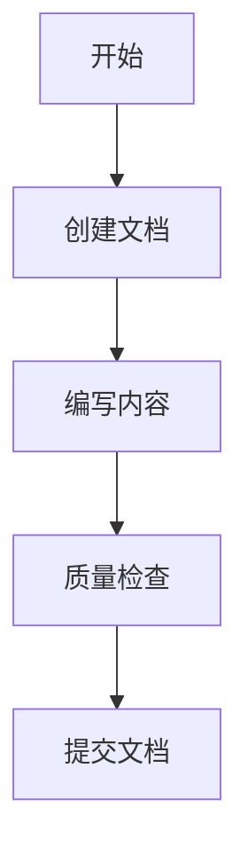

# 📚 项目文档体系使用指南

**文档版本**: v1.0  
**创建时间**: 2025-09-29  
**最后更新**: 2025-09-29  
**维护者**: 开发团队  

---

## 📋 概述

本指南介绍智能视频会议平台项目的完整文档管理体系，包括文档结构、管理规范、工具使用等，帮助团队成员高效地创建、维护和使用项目文档。

## 🏗️ 文档体系架构

### 核心文档组织

```
📚 文档管理中心
├── 🎯 项目状态分析报告 (根目录: PROJECT_STATUS_ANALYSIS.md)
├── 📁 docs/ (主文档目录)
│   ├── 📖 README.md (文档管理中心)
│   ├── 📄 templates/ (文档模板)
│   ├── 🏗️ architecture/ (架构设计)
│   ├── 💻 development/ (开发文档)
│   ├── 🔗 api/ (API文档)
│   ├── 🚀 deployment/ (部署文档)
│   ├── 🧪 testing/ (测试文档)
│   ├── 📊 progress-reports/ (进度报告)
│   ├── 📝 technical-notes/ (技术笔记)
│   └── 📅 meeting-minutes/ (会议记录)
└── 🛠️ scripts/docs-manager.sh (文档管理脚本)
```

### 已建立的核心文档

#### 1. 项目总览文档
- **[项目状态分析报告](PROJECT_STATUS_ANALYSIS.md)**: 项目整体状态、技术架构、进度评估
- **[进度报告详版](docs/progress-reports/2025-09-29-project-status-analysis.md)**: 完整的项目分析

#### 2. 文档管理体系
- **[文档管理中心](docs/README.md)**: 文档索引和导航
- **[文档管理规范](docs/development/documentation-standards.md)**: 完整的文档标准
- **[文档模板](docs/templates/document-template.md)**: 标准化文档模板

#### 3. 管理工具
- **[文档管理脚本](scripts/docs-manager.sh)**: 自动化文档管理工具

---

## 🚀 快速开始

### 1. 浏览现有文档

```bash
# 查看所有文档列表
./scripts/docs-manager.sh list

# 检查文档格式
./scripts/docs-manager.sh check
```

### 2. 创建新文档

```bash
# 创建API文档
./scripts/docs-manager.sh create api user-service-api "用户服务API文档"

# 创建架构文档
./scripts/docs-manager.sh create architecture system-design "系统架构设计"

# 创建技术笔记
./scripts/docs-manager.sh create technical zmq-integration "ZMQ集成技术要点"
```

### 3. 文档编写流程

1. **使用脚本创建文档框架**
   ```bash
   ./scripts/docs-manager.sh create <type> <name> <title>
   ```

2. **编辑文档内容**
   - 使用支持Markdown的编辑器 (推荐VS Code)
   - 遵循文档管理规范
   - 包含必要的图表和示例

3. **质量检查**
   ```bash
   ./scripts/docs-manager.sh check
   ```

4. **更新索引** (手动更新 `docs/README.md`)

5. **Git提交**
   ```bash
   git add docs/
   git commit -m "docs: 新增XXX文档"
   ```

---

## 📖 文档类型和使用场景

### 架构设计文档 (`docs/architecture/`)
**用途**: 系统架构、微服务设计、数据架构等设计文档

**何时创建**:
- 新系统设计阶段
- 架构重构时
- 技术选型决策后

**示例**:
```bash
./scripts/docs-manager.sh create architecture microservices-design "微服务架构设计"
./scripts/docs-manager.sh create architecture data-flow "数据流架构"
```

### API文档 (`docs/api/`)
**用途**: 各微服务的API接口文档

**何时创建**:
- 新服务开发时
- API接口变更时
- 服务间集成前

**示例**:
```bash
./scripts/docs-manager.sh create api meeting-service-api "会议服务API"
./scripts/docs-manager.sh create api ai-service-api "AI推理服务API"
```

### 开发文档 (`docs/development/`)
**用途**: 编码规范、开发流程、环境搭建等

**何时创建**:
- 项目启动时
- 新技术引入时
- 开发流程变更时

**示例**:
```bash
./scripts/docs-manager.sh create development coding-standards "Go/C++编码规范"
./scripts/docs-manager.sh create development git-workflow "Git工作流程"
```

### 部署文档 (`docs/deployment/`)
**用途**: 部署指南、环境配置、运维手册

**何时创建**:
- 部署方案确定后
- 环境配置变更时
- 运维流程建立时

**示例**:
```bash
./scripts/docs-manager.sh create deployment docker-guide "Docker部署指南"
./scripts/docs-manager.sh create deployment k8s-production "K8s生产环境部署"
```

### 测试文档 (`docs/testing/`)
**用途**: 测试策略、测试用例、测试报告

**何时创建**:
- 测试计划制定时
- 重要功能测试后
- 性能测试完成后

**示例**:
```bash
./scripts/docs-manager.sh create testing integration-test "集成测试策略"
./scripts/docs-manager.sh create testing performance-benchmark "性能基准测试"
```

### 进度报告 (`docs/progress-reports/`)
**用途**: 项目进度、里程碑报告、状态分析

**何时创建**:
- 项目里程碑节点
- 定期进度汇报
- 重大变更发生时

**示例**:
```bash
./scripts/docs-manager.sh create progress 2025-10-01-milestone "第一阶段里程碑报告"
./scripts/docs-manager.sh create progress weekly-2025-w40 "第40周工作总结"
```

### 技术笔记 (`docs/technical-notes/`)
**用途**: 技术调研、问题解决、经验总结

**何时创建**:
- 技术难点攻克后
- 重要问题解决后
- 技术选型调研后

**示例**:
```bash
./scripts/docs-manager.sh create technical webrtc-optimization "WebRTC性能优化笔记"
./scripts/docs-manager.sh create technical ai-model-deployment "AI模型部署实践"
```

---

## 📝 文档编写最佳实践

### 1. 结构化写作

```markdown
# 清晰的标题层级
## 主要章节
### 具体内容
#### 详细说明

# 使用列表组织信息
- 要点1
- 要点2
- 要点3

# 代码示例要完整可运行
```go
package main

import "fmt"

func main() {
    fmt.Println("Hello, Documentation!")
}
```

### 2. 视觉化辅助

```markdown
# 使用表格整理信息
| 功能 | 状态 | 负责人 |
|------|------|--------|
| 用户服务 | ✅ 完成 | 张三 |
| 会议服务 | 🔄 进行中 | 李四 |

# 使用Mermaid图表

```

### 3. 链接和引用

```markdown
# 内部文档链接
详见[API设计规范](../api/api-standards.md)

# 外部资源链接
参考[Markdown语法指南](https://www.markdownguide.org/)

# 图片引用

```

---

## 🔧 工具和编辑器推荐

### 编辑器配置

#### VS Code (推荐)
**必装扩展**:
- Markdown All in One
- Markdown Preview Enhanced
- GitLens
- Chinese (Simplified) Language Pack

**推荐设置**:
```json
{
    "markdown.preview.fontSize": 14,
    "markdown.preview.lineHeight": 1.6,
    "files.autoSave": "afterDelay",
    "editor.wordWrap": "on"
}
```

#### Typora (所见即所得)
- 实时预览
- 导出多种格式
- 数学公式支持
- 图表绘制集成

### 图表工具

#### Mermaid (推荐 - 代码化图表)
```mermaid
# 流程图
graph TD
    A --> B
    B --> C

# 时序图
sequenceDiagram
    Alice->>Bob: Hello
    Bob-->>Alice: Hi

# 甘特图
gantt
    title 项目计划
    section 开发
    用户服务    :done, des1, 2025-09-01, 2025-09-15
    会议服务    :active, des2, 2025-09-10, 2025-09-25
```

#### Draw.io (复杂图表)
- 在线免费使用
- 支持多种图表类型
- 可集成到VS Code
- 导出多种格式

---

## 📊 文档管理最佳实践

### 1. 版本控制策略

```bash
# 文档相关提交
git commit -m "docs: 新增用户服务API文档"
git commit -m "docs: 更新系统架构设计"
git commit -m "docs: 修复部署文档链接错误"

# 分支管理
git checkout -b docs/add-api-documentation
git checkout -b docs/update-architecture
```

### 2. 定期维护

**每周任务**:
- [ ] 检查文档链接有效性
- [ ] 更新过期信息
- [ ] 同步代码变更到文档

**每月任务**:
- [ ] 评估文档完整性
- [ ] 清理过期文档
- [ ] 更新文档索引

**每季度任务**:
- [ ] 全面审查文档质量
- [ ] 优化文档结构
- [ ] 培训新团队成员

### 3. 质量保证

```bash
# 使用文档管理脚本检查
./scripts/docs-manager.sh check

# 手动检查清单
- [ ] 标题层级正确
- [ ] 链接全部有效
- [ ] 代码示例可运行
- [ ] 图表显示正常
- [ ] 格式符合规范
```

---

## 📞 获取帮助

### 文档管理脚本帮助

```bash
# 查看所有命令
./scripts/docs-manager.sh help

# 查看当前文档列表
./scripts/docs-manager.sh list

# 检查文档质量
./scripts/docs-manager.sh check
```

### 常见问题

#### Q: 如何选择文档类型？
A: 根据文档内容和用途选择：
- 设计类文档 → architecture
- 接口文档 → api  
- 操作指南 → development/deployment
- 总结报告 → progress/technical

#### Q: 文档应该多详细？
A: 遵循"能让新同事理解并执行"的原则：
- 包含必要的背景信息
- 提供完整的示例
- 说明前置条件和限制
- 给出故障排除指导

#### Q: 如何处理图片和资源？
A: 建立统一的资源管理：
- 创建 `docs/images/` 目录
- 使用描述性文件名
- 压缩图片大小
- 提供图片备用文字

---

## 🎯 下一步行动

### 立即可做
1. **熟悉文档结构**: 浏览 `docs/` 目录了解现有文档
2. **安装工具**: 配置VS Code和Markdown扩展
3. **试用脚本**: 使用 `docs-manager.sh` 创建测试文档
4. **阅读规范**: 详细阅读文档管理规范

### 短期计划 (1周内)
1. **创建关键文档**: 根据职责创建相关文档
2. **建立习惯**: 将文档更新纳入开发流程
3. **团队培训**: 向团队成员介绍文档体系
4. **反馈改进**: 收集使用反馈并优化

### 长期目标 (1月内)
1. **完善文档**: 补全所有关键文档
2. **自动化**: 扩展文档管理脚本功能
3. **集成CI/CD**: 将文档检查集成到持续集成
4. **建立文化**: 形成重视文档的团队文化

---

**文档管理原则**: 
- 📝 **记录即时**: 有想法立即记录
- 🔄 **持续更新**: 随代码变更同步更新  
- 👥 **团队共享**: 知识属于整个团队
- 📚 **质量优先**: 宁可少而精，不要多而杂

**记住**: 好的文档是团队协作的基石，投入在文档上的时间会在项目长期发展中得到回报！ 