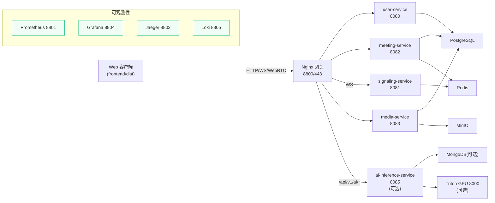
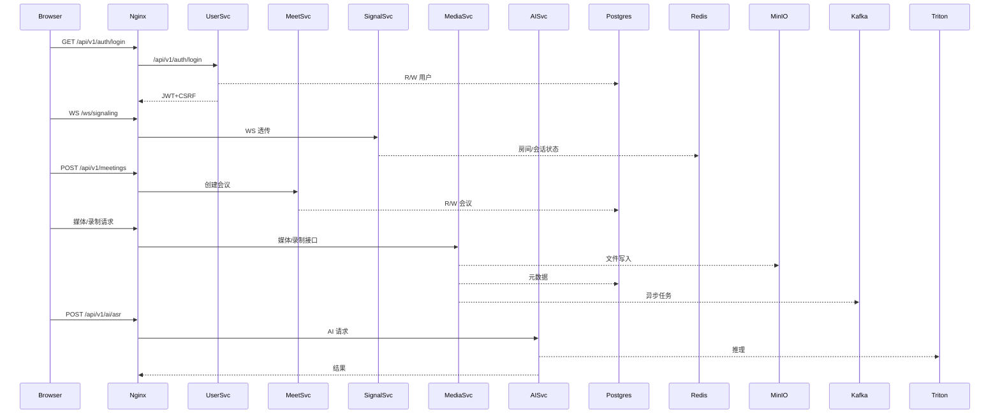
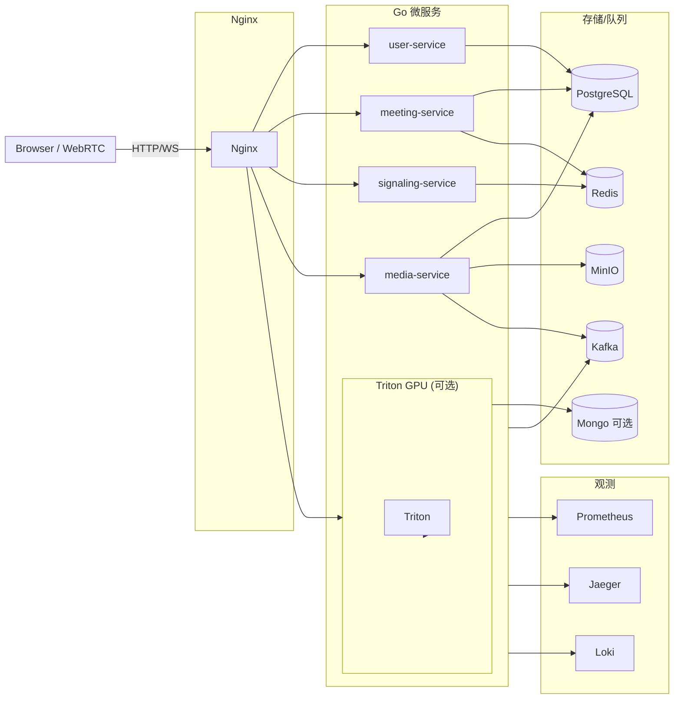

# 🎥 Meeting System - Go/WebRTC 视频会议平台

演示地址：https://www.safemeeting.top  
主工程位于 `meeting-system/`，包含网关、微服务、监控栈与已构建的 Web 客户端。默认通过 Docker Compose 运行，也提供远程、GPU 与 K8s 示例。

## 项目概览

- **微服务**：`user-service`（用户与认证）、`signaling-service`（WebSocket 信令）、`meeting-service`（会议/参会者）、`media-service`（媒体/录制），可选 `ai-inference-service`（AI 推理）。
- **基础设施**：PostgreSQL、Redis、Kafka（队列/事件总线）、MongoDB（AI 数据，可选）、MinIO、etcd。
- **网关与前端**：Nginx 负责反代与静态文件；`frontend/dist` 已内置编译产物。
- **可观测性**：Prometheus + Alertmanager、Jaeger、Grafana、Loki/Promtail 开箱即用。
- **AI 能力**：通过 `ai-inference-service` 直连 Triton（GPU）。本地 `docker-compose.yml` 默认注释该服务，远程/独立 GPU 方案见 `docs/DEPLOYMENT/`。

## 前置要求

- Docker 20+、Docker Compose v2+
- CPU 8C/16G 起步；如启用 AI+GPU，需要可用的 NVIDIA 驱动/CUDA
- 外网可拉取镜像，已安装 `git`、`curl`
- 建议预先创建 `meeting-system/.env` 管理密钥与凭据

## 快速启动

```bash
cd meeting-system
docker compose up -d
```

默认入口：`http://localhost:8800`。  
如需 AI 推理，可改用 `docker-compose.remote.yml` 或 `deployment/gpu-ai/docker-compose.gpu-ai.yml` 启动带 Triton/AI 的组合。

必须提前设置（可写入 `meeting-system/.env`）：
- `JWT_SECRET`：强随机值
- `ALLOWED_ORIGINS`：允许的前端域名/端口（逗号分隔）
- TLS 证书放在 `meeting-system/nginx/ssl/`（`fullchain.pem` / `privkey.pem`）
建议同步修改数据库/MinIO/Kafka/Redis 的默认密码，并确认暴露端口未被占用。

常用命令：
```bash
docker compose ps                   # 查看状态
docker compose logs -f nginx        # 查看网关日志
curl http://localhost:8800/health   # 健康检查
```

## 栈与端口

| 角色 | 端口/入口 | 说明 |
| --- | --- | --- |
| Nginx 网关 | 8800/443 | 统一 HTTP/WS 入口，托管前端 |
| user-service | 8080 | 注册/登录、JWT、CSRF |
| signaling-service | 8081 | WebSocket `/ws/signaling`，会话/房间状态 |
| meeting-service | 8082 | 会议 CRUD、参会者、录制元数据 |
| media-service | 8083 | 媒体上传/下载、录制控制、WebRTC 辅助 |
| ai-inference-service* | 8085 | AI 推理 HTTP/gRPC，依赖 Triton（可选） |
| PostgreSQL / Redis / Kafka / MongoDB / MinIO / etcd | 内网 | 仅容器内访问 |
| Prometheus / Alertmanager / Jaeger / Grafana / Loki | 8801~8805 | 监控与日志 |

\* `ai-inference-service` 与 `triton` 默认不在基础 compose 中启动。

## 架构速览



完整数据流与依赖请参考 `meeting-system/docs/ARCHITECTURE_DIAGRAM.md`。

### 数据与调用流（示意）



### 服务交互图（含 Kafka/观测）



交互要点：
- 用户/会议/信令/媒体统一经 Nginx 进入对应微服务；WS 信令透传至 `signaling-service`。
- 状态与会话：Redis 维护房间/会话/限流；Postgres 存储核心业务数据；MinIO 持久化录制/媒资；Kafka 承载任务与事件（`meeting.*`）。
- AI：`ai-inference-service` 可选，调用 Triton GPU，结果可落 Mongo（按需）；上游由 Nginx upstream 负载。
- 观测：各服务 `/metrics` 采集到 Prometheus，Trace 到 Jaeger，日志到 Loki；默认 compose 已内置。

## 目录与文档

- `meeting-system/README.md`：后端与运维总览
- `meeting-system/docs/`：架构、API、部署、客户端、开发/测试
- `meeting-system/deployment/`：K8s、GPU AI、远程部署示例
- `meeting-system/nginx/`：网关与 AI upstream 模板
- `meeting-system/monitoring/`：Prometheus/Grafana/Loki 配置

## 开发与测试

- 基础依赖就绪后，可在对应子目录执行 `go run . -config=...` 启动单个服务。
- 集成测试脚本：`meeting-system/backend/tests/run_all_tests.sh`、`quick_integration_test.sh`、`test_nginx_gateway.sh`。
- 端到端脚本：`meeting-system/tests/e2e_queue_integration_test.{sh,py}`（含信令与可选 AI）。

## 监控与日志

- 指标：各服务 `/metrics` → Prometheus（8801）
- Trace：Jaeger UI `http://localhost:8803`
- 日志：Loki（8805），在 Grafana Explore 查询

更多细节、部署与客户端调用示例请查阅 `meeting-system/docs/README.md`。如启动异常，先检查 `docker compose ps`、`docker compose logs -f nginx`，并确保 8800/443 等端口未被占用。

## 常见问题

- **401/403**：确认 `JWT_SECRET` 一致且前端携带最新 Token，必要时重新登录。
- **容器未起**：检查内存/端口占用，`docker compose ps` 查看健康状态。
- **AI 404/报错**：确保已启用 `ai-inference-service`+Triton 且模型配置匹配。
- **录制/上传失败**：核对 MinIO 凭据、桶名称与磁盘空间。
- **Kafka 未消费**：检查 `docker compose logs -f kafka`，使用 `kafka-topics.sh --list` 与 `kafka-consumer-groups.sh --describe` 查看主题与滞后；必要时降低到内存队列以排查。

## 架构概要（含 Kafka / K8s）

- **核心栈**：Nginx 网关托管前端并反代 Go 微服务（user/meeting/signaling/media）；Kafka 作为任务队列与事件总线（主题前缀 `meeting.*`）；存储由 PostgreSQL + Redis + MinIO 组成，AI 能力由可选 `ai-inference-service` + Triton 提供。
- **可观测性**：Prometheus/Alertmanager/Jaeger/Grafana/Loki 默认随 compose 启动，所有服务暴露 `/metrics` 与 trace。
- **K8s 部署**：`deployment/k8s/` 提供 kustomize 示例，内置单节点 KRaft Kafka 与 `emptyDir` 存储；生产需改为外部 Kafka/DB/对象存储 + PVC + Ingress/证书，并在 `services.yaml` 中替换镜像与凭据。
- **扩展与高可用**：user/meeting/signaling/media/ai 可横向扩容；Kafka/Redis/Postgres/MinIO 建议使用托管或集群版；AI 上游可通过 Nginx upstream 挂载多 GPU 节点。
