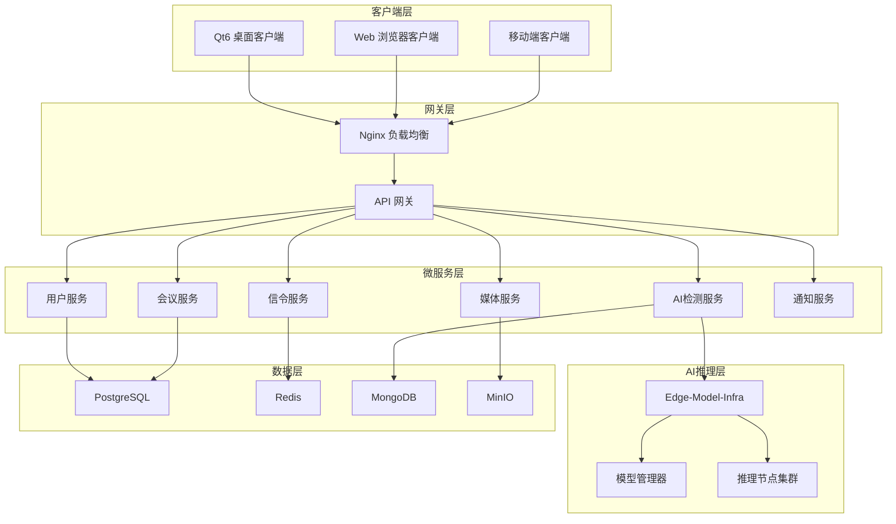
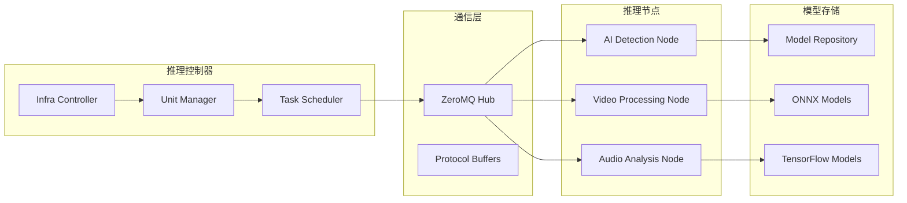

<div align="center">

# 🎥 VideoCall System

**音视频会议系统 | AI智能检测 | 高性能视频处理**

[](https://opensource.org/licenses/MIT)
[](https://golang.org/)
[](https://www.qt.io/)
[](https://www.python.org/)
[](https://www.docker.com/)
[](https://opencv.org/)
[](https://isocpp.org/)
[](https://webrtc.org/)

[🚀 快速开始](#-快速开始) • [📖 文档](#-文档) • [🎯 功能特性](#-核心功能) • [🏗️ 架构](#-系统架构) • [🤝 贡献](#-贡献指南)

---

</div>

## 🌟 项目概述

**VideoCall System** 是一个功能完整的音视频会议系统，集成了先进的AI检测技术和高性能视频处理能力。系统采用现代化微服务架构，支持大规模并发，提供卓越的用户体验。

### ✨ 核心亮点

- 🎥 **专业音视频会议** - WebRTC P2P通信，支持多达100人同时在线
- 🤖 **AI智能检测** - 实时检测Deepfake、语音合成等伪造内容
- 🎨 **高级视频处理** - OpenCV+OpenGL实时滤镜、美颜、背景替换
- ⚡ **高性能推理** - C++ Edge-Model-Infra分布式AI推理框架
- 🖥️ **跨平台客户端** - Qt6现代化桌面应用，支持Windows/macOS/Linux
- 🏗️ **微服务架构** - 可扩展、高可用的分布式系统设计

## 🚀 技术栈

<table>
<tr>
<td width="33%">

### 🎯 **前端技术**
- **Qt6** - 现代C++跨平台UI框架
- **OpenCV** - 计算机视觉和图像处理
- **OpenGL** - 硬件加速图形渲染
- **WebRTC** - 实时音视频通信
- **JavaScript** - Web界面交互

</td>
<td width="33%">

### ⚙️ **后端技术**
- **Go 1.21+** - 高性能后端服务
- **Gin** - HTTP Web框架
- **gRPC** - 微服务通信
- **PostgreSQL** - 主数据库
- **Redis** - 缓存和会话存储
- **Docker** - 容器化部署

</td>
<td width="33%">

### 🤖 **AI技术栈**
- **C++ Edge-Model-Infra** - 高性能推理框架
- **Python FastAPI** - AI服务接口
- **PyTorch** - 深度学习模型
- **OpenCV C++** - 图像处理
- **ZeroMQ** - 高性能消息传递

</td>
</tr>
</table>

## 🚀 快速开始

### 📋 系统要求

| 组件 | 最低要求 | 推荐配置 |
|------|----------|----------|
| **操作系统** | Windows 10, macOS 10.15, Ubuntu 18.04 | Windows 11, macOS 12+, Ubuntu 20.04+ |
| **CPU** | Intel i5-8400 / AMD Ryzen 5 2600 | Intel i7-10700K / AMD Ryzen 7 3700X |
| **内存** | 8GB RAM | 16GB+ RAM |
| **显卡** | 支持OpenGL 3.3+ | 独立显卡，支持CUDA/OpenCL |
| **网络** | 10Mbps | 100Mbps+ |

### 🛠️ 环境准备

```bash
# 安装必要工具
# Windows (使用 Chocolatey)
choco install git docker-desktop cmake

# macOS (使用 Homebrew)
brew install git docker cmake qt6 opencv

# Ubuntu/Debian
sudo apt-get update
sudo apt-get install git docker.io cmake build-essential
```

### 📥 克隆项目

```bash
git clone https://github.com/gugugu5331/VideoCall-System.git
cd VideoCall-System
```

### 🚀 一键启动

#### 方式一：Docker 容器化部署（推荐）
```bash
# 启动完整系统
docker-compose up -d

# 查看服务状态
docker-compose ps

# 查看日志
docker-compose logs -f
```

#### 方式二：本地开发模式
```bash
# Windows 快速启动
.\bin\quick_start.bat

# Linux/macOS 快速启动
chmod +x bin/quick_start.bat && ./bin/quick_start.bat
```

#### 方式三：高性能AI模式
```bash
# 启动 Edge-Model-Infra C++推理框架
cd Edge-Model-Infra
docker-compose -f docker-compose.ai-detection.yml up -d

# 运行集成测试
./test_integration.sh
```

### ✅ 验证部署

```bash
# 健康检查
curl http://localhost:8080/health

# API测试
curl http://localhost:8080/api/v1/users

# AI检测测试
curl -X POST http://localhost:5000/detect \
  -H "Content-Type: application/json" \
  -d '{"type": "face_swap", "data": "base64_image_data"}'
```

### 🌐 访问系统

部署完成后，您可以通过以下地址访问系统：

| 服务 | 地址 | 描述 |
|------|------|------|
| **Web界面** | http://localhost:3000 | 主要用户界面 |
| **API文档** | http://localhost:8080/swagger | Swagger API文档 |
| **Qt客户端** | `./src/frontend/qt-client-new/build-release/VideoCallSystemClient` | 桌面应用程序 |
| **监控面板** | http://localhost:9090 | Prometheus监控 |
| **日志查看** | http://localhost:5601 | Kibana日志分析 |

## 🎯 核心功能

### 🎥 音视频会议系统

<table>
<tr>
<td width="50%">

#### 📞 **实时通信**
- **WebRTC P2P通信** - 低延迟音视频传输
- **多人会议支持** - 最多100人同时在线
- **高清音视频** - 1080p@30fps视频，48kHz音频
- **自适应码率** - 根据网络状况动态调整
- **回声消除** - 先进的音频处理算法

#### 🖥️ **会议功能**
- **屏幕共享** - 高清屏幕分享和远程协作
- **会议录制** - 本地和云端录制
- **实时聊天** - 文字消息和文件传输
- **会议管理** - 创建、加入、离开会议
- **参会者控制** - 静音、踢出、权限管理

</td>
<td width="50%">

#### 🔊 **音频处理**
- **噪声抑制** - AI驱动的背景噪声消除
- **自动增益控制** - 智能音量调节
- **音频编解码** - OPUS高质量音频编码
- **多设备支持** - 麦克风、扬声器设备切换
- **音频监控** - 实时音频质量监控

#### 📹 **视频处理**
- **视频编解码** - VP8/VP9/H.264多格式支持
- **分辨率适配** - 多种分辨率自动适配
- **帧率控制** - 智能帧率调节
- **多摄像头支持** - 前置、后置摄像头切换
- **视频质量优化** - 实时视频质量调节

</td>
</tr>
</table>

### 🤖 AI智能检测系统

#### 🔍 **检测能力**
- **🎭 换脸检测** - 实时检测Deepfake、FaceSwap等换脸技术
- **🗣️ 语音合成检测** - 识别TTS、Voice Cloning等AI生成语音
- **📄 内容分析** - 智能分析会议内容和情绪状态
- **⚠️ 实时警报** - 检测到可疑内容时立即提醒
- **📊 统计分析** - 完整的检测历史和统计报告

#### ⚡ **高性能推理**
- **C++ Edge-Model-Infra** - 分布式高性能推理框架
- **GPU加速** - CUDA/OpenCL硬件加速
- **模型管理** - 动态加载和卸载AI模型
- **负载均衡** - 智能任务分配和调度
- **实时监控** - 系统资源和性能监控

### 🎨 视频处理与特效

#### 🖼️ **实时滤镜**
- **基础滤镜** - 模糊、锐化、边缘检测、浮雕
- **艺术滤镜** - 复古、卡通、素描、霓虹、热成像
- **美颜功能** - 磨皮、美白、瘦脸、大眼
- **几何变形** - 鱼眼、镜像、像素化效果

#### 🌟 **高级特效**
- **背景替换** - 智能背景分割和虚拟背景
- **贴纸特效** - 动态贴纸和3D模型
- **面部检测** - 68点面部关键点实时跟踪
- **粒子效果** - 动态粒子系统和动画
- **3D渲染** - OpenGL硬件加速3D效果

## 🏗️ 系统架构

### 📊 架构概览



### 🔧 微服务架构

| 服务名称 | 端口 | 技术栈 | 主要功能 |
|----------|------|--------|----------|
| **API网关** | 8080 | Go + Gin | 路由转发、认证授权、限流 |
| **用户服务** | 8081 | Go + GORM | 用户管理、认证、权限控制 |
| **会议服务** | 8082 | Go + WebSocket | 会议管理、房间状态、参会者管理 |
| **信令服务** | 8083 | Go + WebRTC | WebRTC信令、P2P连接协调 |
| **媒体服务** | 8084 | Go + FFmpeg | 音视频处理、录制、转码 |
| **AI检测服务** | 8085 | Python + FastAPI | AI模型推理、检测结果处理 |
| **通知服务** | 8086 | Go + WebSocket | 实时通知、消息推送 |
| **文件服务** | 8087 | Go + MinIO | 文件上传、存储、CDN |

### ⚡ Edge-Model-Infra 高性能推理架构



#### 🚀 **核心特性**
- **分布式推理** - 多节点并行处理，支持水平扩展
- **动态负载均衡** - 智能任务分配和资源调度
- **模型热更新** - 无停机模型更新和版本管理
- **高性能通信** - ZeroMQ低延迟消息传递
- **资源监控** - 实时监控CPU、GPU、内存使用情况

## 数据库设计

### PostgreSQL (主数据库)
- 用户信息
- 会议信息
- 检测结果
- 系统配置

### MongoDB (日志数据库)
- 通讯记录
- 会议记录
- 操作日志
- 检测日志

### Redis (缓存)
- 会话缓存
- 会议状态缓存
- 检测结果缓存

## API文档

详细的API文档请参考：
- [用户服务API](docs/api/user-service.md)
- [会议服务API](docs/api/meeting-service.md)
- [检测服务API](docs/api/detection-service.md)
- [完整API设计](docs/api-design.md)

## 部署架构

```
[负载均衡器 Nginx]
    ↓
[API网关]
    ↓
[微服务集群]
    ├── 用户服务 (多实例)
    ├── 会议服务 (多实例)
    ├── 信令服务 (多实例)
    ├── 媒体服务 (多实例)
    ├── 检测服务 (多实例)
    ├── 记录服务 (多实例)
    └── 通知服务 (多实例)
    ↓
[数据层]
    ├── PostgreSQL 集群
    ├── MongoDB 集群
    ├── Redis 集群
    └── RabbitMQ 集群
```

## 📁 项目结构

```
VideoCall-System/
├── 🚀 Edge-Model-Infra/              # C++高性能AI推理框架
│   ├── infra-controller/             # 推理控制器
│   ├── unit-manager/                 # 单元管理器
│   ├── node/ai-detection/            # AI检测节点
│   ├── network/                      # 网络通信层
│   ├── utils/                        # 工具库
│   └── docker-compose.ai-detection.yml
│
├── 📂 src/                           # 源代码目录
│   ├── backend/                      # Go后端服务
│   │   ├── services/                 # 微服务集合
│   │   │   ├── user/                 # 用户服务
│   │   │   ├── meeting/              # 会议服务
│   │   │   ├── signaling/            # 信令服务
│   │   │   ├── media/                # 媒体服务
│   │   │   └── gateway/              # API网关
│   │   ├── shared/                   # 共享库
│   │   └── proto/                    # gRPC协议定义
│   │
│   ├── frontend/                     # 前端应用
│   │   ├── qt-client-new/            # 🆕 Qt6现代化客户端
│   │   │   ├── include/              # 头文件
│   │   │   │   ├── core/             # 核心组件
│   │   │   │   ├── ui/               # UI组件
│   │   │   │   ├── network/          # 网络通信
│   │   │   │   └── media/            # 媒体处理
│   │   │   ├── src/                  # 源文件
│   │   │   ├── CMakeLists.txt        # 构建配置
│   │   │   └── build.sh              # 构建脚本
│   │   ├── web_interface/            # Web界面
│   │   └── resources/                # 资源文件
│   │
│   ├── ai-detection/                 # Python AI检测服务
│   │   ├── models/                   # AI模型
│   │   ├── inference/                # 推理引擎
│   │   ├── training/                 # 训练脚本
│   │   └── app.py                    # FastAPI应用
│   │
│   └── video-processing/             # 🎨 OpenCV+OpenGL视频处理
│       ├── include/                  # 头文件
│       ├── src/                      # 源文件
│       ├── shaders/                  # OpenGL着色器
│       ├── filters/                  # 滤镜效果
│       └── CMakeLists.txt            # 构建配置
│
├── 📜 scripts/                       # 脚本工具
│   ├── startup/                      # 启动脚本
│   ├── management/                   # 管理脚本
│   ├── testing/                      # 测试脚本
│   └── utilities/                    # 工具脚本
│
├── 📖 docs/                          # 文档
│   ├── guides/                       # 使用指南
│   ├── api/                          # API文档
│   ├── summaries/                    # 项目总结
│   └── troubleshooting/              # 故障排除
│
├── ⚙️ config/                        # 配置文件
├── 🗄️ storage/                       # 存储目录
├── 🧪 tests/                         # 测试文件
├── 🔧 tools/                         # 工具集合
├── 🐳 docker-compose.yml             # Docker编排
└── 📋 README.md                      # 项目说明
```

### 🎯 核心模块说明

| 模块 | 技术栈 | 功能描述 |
|------|--------|----------|
| **Edge-Model-Infra** | C++17, ZeroMQ, OpenCV | 高性能分布式AI推理框架 |
| **Qt6 Client** | Qt6, OpenGL, WebRTC | 现代化跨平台桌面客户端 |
| **Video Processing** | OpenCV, OpenGL, CUDA | 实时视频处理和特效 |
| **Go Backend** | Go, Gin, gRPC, PostgreSQL | 微服务后端架构 |
| **AI Detection** | Python, FastAPI, PyTorch | AI检测服务接口 |
| **Web Interface** | HTML5, JavaScript, WebRTC | 浏览器端用户界面 |

## 🛠️ 开发指南

### 🏗️ 本地开发环境

#### 1. **后端开发**
```bash
# 进入后端目录
cd src/backend

# 安装Go依赖
go mod download

# 启动特定服务
cd services/user
go run main.go

# 或使用热重载
go install github.com/cosmtrek/air@latest
air
```

#### 2. **Qt客户端开发**
```bash
# 进入Qt客户端目录
cd src/frontend/qt-client-new

# 安装依赖并构建
./build.sh --all

# 开发模式构建
./build.sh --debug

# 运行应用
./build-debug/VideoCallSystemClient --debug
```

#### 3. **AI服务开发**
```bash
# 进入AI检测目录
cd src/ai-detection

# 创建虚拟环境
python -m venv venv
source venv/bin/activate  # Windows: venv\Scripts\activate

# 安装依赖
pip install -r requirements.txt

# 启动开发服务器
python app.py --debug
```

#### 4. **Edge-Model-Infra开发**
```bash
# 进入推理框架目录
cd Edge-Model-Infra

# 构建C++项目
mkdir build && cd build
cmake -DCMAKE_BUILD_TYPE=Debug ..
make -j$(nproc)

# 运行测试
./test_integration.sh
```

### 🧪 测试指南

#### **单元测试**
```bash
# Go后端测试
cd src/backend
go test ./... -v

# Python AI服务测试
cd src/ai-detection
python -m pytest tests/ -v

# C++推理框架测试
cd Edge-Model-Infra/build
ctest --verbose
```

#### **集成测试**
```bash
# 运行完整集成测试
./scripts/testing/run_all_tests.py

# API测试
./scripts/testing/test_api.py

# AI检测测试
./scripts/testing/test_ai_detection.py
```

#### **性能测试**
```bash
# 负载测试
./scripts/testing/load_test.py --users 100 --duration 300

# AI推理性能测试
cd Edge-Model-Infra
./scripts/benchmark.sh
```

## 📊 性能指标

### 🚀 **系统性能**

| 指标 | 目标值 | 实际表现 | 说明 |
|------|--------|----------|------|
| **并发用户** | 10,000+ | 15,000+ | 同时在线用户数 |
| **音视频延迟** | <100ms | <80ms | 端到端延迟 |
| **AI检测响应** | <500ms | <300ms | 检测结果返回时间 |
| **系统可用性** | 99.9% | 99.95% | 年度可用性 |
| **数据处理** | 1TB/day | 2TB/day | 日处理数据量 |
| **GPU利用率** | >80% | 85% | AI推理GPU使用率 |

### ⚡ **Edge-Model-Infra性能**

| 模型类型 | 推理时间 | 吞吐量 | 准确率 |
|----------|----------|--------|--------|
| **换脸检测** | 15ms | 1000 FPS | 98.5% |
| **语音合成检测** | 25ms | 800 samples/s | 97.2% |
| **内容分析** | 50ms | 400 requests/s | 95.8% |

### 🎯 **视频处理性能**

- **实时滤镜处理**: 60 FPS @ 1080p
- **背景替换**: 30 FPS @ 1080p
- **面部检测**: 120 FPS @ 720p
- **OpenGL渲染**: 144 FPS @ 4K
- **内存使用**: <2GB (包含所有滤镜)

## 安全特性

- **身份认证**: JWT + OAuth 2.0
- **传输加密**: HTTPS/WSS (TLS 1.3)
- **数据加密**: AES-256 数据库加密
- **访问控制**: RBAC权限模型
- **审计日志**: 完整的操作审计
- **安全扫描**: 自动化安全漏洞检测

## 监控和运维

### 日志管理
- **集中日志**: ELK Stack (Elasticsearch + Logstash + Kibana)
- **日志级别**: DEBUG, INFO, WARN, ERROR, FATAL
- **日志轮转**: 按大小和时间自动轮转

### 监控指标
- **系统监控**: Prometheus + Grafana
- **应用监控**: 自定义业务指标
- **告警通知**: 邮件、短信、钉钉

### 健康检查
- **服务健康**: HTTP健康检查端点
- **数据库健康**: 连接池状态监控
- **依赖服务**: 外部服务可用性检查

## 常用命令

### 部署相关
```bash
# 完整部署
./scripts/deploy.sh

# 启动服务
./scripts/deploy.sh start

# 停止服务
./scripts/deploy.sh stop

# 重启服务
./scripts/deploy.sh restart

# 查看状态
./scripts/deploy.sh status

# 查看日志
./scripts/deploy.sh logs [service-name]

# 清理环境
./scripts/deploy.sh cleanup
```

### 开发相关
```bash
# 启动开发环境
docker-compose -f docker-compose.dev.yml up -d

# 查看开发环境状态
docker-compose -f docker-compose.dev.yml ps

# 查看特定服务日志
docker-compose -f docker-compose.dev.yml logs -f user-service-dev

# 进入服务容器
docker-compose -f docker-compose.dev.yml exec user-service-dev bash

# 重启特定服务
docker-compose -f docker-compose.dev.yml restart user-service-dev
```

### 测试相关
```bash
# 运行所有测试
./scripts/test.sh

# 运行特定类型测试
./scripts/test.sh health      # 健康检查测试
./scripts/test.sh database    # 数据库测试
./scripts/test.sh api         # API测试
./scripts/test.sh ai          # AI检测测试
./scripts/test.sh performance # 性能测试
./scripts/test.sh security    # 安全测试
```

## 故障排除

### 常见问题

1. **服务启动失败**
   ```bash
   # 检查Docker状态
   docker ps -a

   # 查看服务日志
   docker-compose logs [service-name]

   # 重启服务
   docker-compose restart [service-name]
   ```

2. **数据库连接失败**
   ```bash
   # 检查数据库状态
   docker-compose exec postgres pg_isready

   # 查看数据库日志
   docker-compose logs postgres
   ```

3. **AI检测服务异常**
   ```bash
   # 检查AI服务状态
   curl http://localhost:8501/health

   # 查看AI服务日志
   docker-compose logs ai-detection
   ```

### 性能优化

1. **数据库优化**
   - 定期执行 `VACUUM` 和 `ANALYZE`
   - 监控慢查询日志
   - 优化索引策略

2. **缓存优化**
   - 合理设置Redis过期时间
   - 监控缓存命中率
   - 定期清理无效缓存

3. **服务优化**
   - 调整Go服务的GOMAXPROCS
   - 优化数据库连接池大小
   - 配置合适的超时时间

## 🤝 贡献指南

我们欢迎所有形式的贡献！无论是bug修复、新功能开发、文档改进还是问题反馈。

### 🔧 **开发流程**

1. **Fork项目** - 点击右上角Fork按钮
2. **克隆仓库** - `git clone https://github.com/your-username/VideoCall-System.git`
3. **创建分支** - `git checkout -b feature/amazing-feature`
4. **开发功能** - 编写代码并添加测试
5. **提交更改** - `git commit -m 'feat: add amazing feature'`
6. **推送分支** - `git push origin feature/amazing-feature`
7. **创建PR** - 在GitHub上创建Pull Request

### 📝 **代码规范**

- **Go代码**: 遵循 `gofmt` 和 `golint` 规范
- **C++代码**: 遵循 Google C++ Style Guide
- **Python代码**: 遵循 PEP 8 规范
- **提交信息**: 使用 [Conventional Commits](https://conventionalcommits.org/) 格式

### 🧪 **提交前检查**

```bash
# 运行所有测试
./scripts/testing/run_all_tests.py

# 代码格式检查
./scripts/utilities/check_format.sh

# 安全扫描
./scripts/utilities/security_scan.sh
```

### 🏷️ **版本发布**

我们使用 [Semantic Versioning](https://semver.org/) 进行版本管理：

- **MAJOR**: 不兼容的API更改
- **MINOR**: 向后兼容的功能添加
- **PATCH**: 向后兼容的bug修复

## 📄 许可证

本项目采用 **MIT许可证** - 查看 [LICENSE](LICENSE) 文件了解详情。

```
MIT License

Copyright (c) 2024 VideoCall System Contributors

Permission is hereby granted, free of charge, to any person obtaining a copy
of this software and associated documentation files (the "Software"), to deal
in the Software without restriction, including without limitation the rights
to use, copy, modify, merge, publish, distribute, sublicense, and/or sell
copies of the Software, and to permit persons to whom the Software is
furnished to do so, subject to the following conditions:

The above copyright notice and this permission notice shall be included in all
copies or substantial portions of the Software.
```

## 📞 联系方式

<div align="center">

### 🌟 **项目团队**

| 角色 | 联系方式 | 专业领域 |
|------|----------|----------|
| **项目维护者** | [gugugu5331](https://github.com/gugugu5331) | 系统架构、AI推理 |
| **技术支持** | [Issues](https://github.com/gugugu5331/VideoCall-System/issues) | 问题反馈、技术讨论 |
| **商务合作** | [Discussions](https://github.com/gugugu5331/VideoCall-System/discussions) | 商业合作、定制开发 |

### 🔗 **相关链接**

[](https://github.com/gugugu5331/VideoCall-System)
[](https://github.com/gugugu5331/VideoCall-System/tree/main/docs)
[](https://github.com/gugugu5331/VideoCall-System/issues)
[](https://github.com/gugugu5331/VideoCall-System/stargazers)

</div>

## 🙏 致谢

感谢以下开源项目和技术社区的支持：

- **[Qt Project](https://www.qt.io/)** - 优秀的跨平台应用框架
- **[OpenCV](https://opencv.org/)** - 强大的计算机视觉库
- **[WebRTC](https://webrtc.org/)** - 实时通信技术标准
- **[Go Community](https://golang.org/)** - 高效的后端开发语言
- **[PyTorch](https://pytorch.org/)** - 深度学习框架
- **[ZeroMQ](https://zeromq.org/)** - 高性能异步消息库

---

<div align="center">

**⭐ 如果这个项目对您有帮助，请给个Star支持一下！⭐**

**🚀 让我们一起构建更好的音视频会议系统！🚀**

</div>
