# 🎥 智能会议系统 - Meeting System

[](https://opensource.org/licenses/MIT)
[](https://golang.org/)
[](https://isocpp.org/)
[](https://www.docker.com/)
[](https://webrtc.org/)
[](https://www.qt.io/)

基于 SFU 架构的企业级智能音视频会议系统，集成分布式 AI 推理框架，提供实时 AI 检测、音视频增强、智能分析等功能。

## 🏗️ 系统架构

```mermaid
graph TB
    subgraph Client["🖥️ 客户端层"]
        Qt6["Qt6 桌面客户端<br/>(Windows/Linux/macOS)"]
        Web["🌐 Web 浏览器<br/>(Chrome/Firefox)"]
        Mobile["📱 移动端<br/>(iOS/Android)"]
    end

    subgraph Gateway["🌐 网关层"]
        Nginx["Nginx 负载均衡<br/>8800/8443<br/>HTTP/HTTPS"]
        APIGateway["API 网关<br/>路由/限流/认证"]
    end

    subgraph Microservices["🎯 微服务层 Go 1.24 + Gin"]
        UserSvc["👤 用户服务<br/>:8080<br/>认证/授权/用户管理"]
        MeetingSvc["📞 会议服务<br/>:8082<br/>会议管理/参与者管理"]
        SignalSvc["📡 信令服务<br/>:8081<br/>WebSocket/媒体协商"]
        MediaSvc["🎬 媒体服务<br/>:8083<br/>SFU转发/录制/转码"]
        AISvc["🤖 AI检测服务<br/>:8084<br/>情感/合成/音频处理"]
        NotifySvc["🔔 通知服务<br/>:8085<br/>邮件/短信/推送"]
    end

    subgraph AILayer["🤖 AI推理层 Edge-LLM-Infra"]
        ModelMgr["模型管理器<br/>加载/卸载/版本管理"]
        InferEngine["推理引擎<br/>C++/GPU优化"]
        InferCluster["推理节点集群<br/>分布式/负载均衡"]
    end

    subgraph DataLayer["💾 数据层"]
        PostgreSQL["🗄️ PostgreSQL<br/>主数据库<br/>用户/会议/参与者"]
        Redis["⚡ Redis<br/>缓存/队列<br/>Session/消息队列"]
        MongoDB["📊 MongoDB<br/>AI数据<br/>推理结果/分析"]
        MinIO["📦 MinIO<br/>对象存储<br/>录制/媒体/头像"]
        Etcd["🔧 etcd<br/>配置管理<br/>服务发现"]
    end

    subgraph Observability["📊 可观测性栈"]
        Prometheus["Prometheus<br/>监控指标"]
        Grafana["Grafana<br/>可视化仪表板"]
        Jaeger["Jaeger<br/>分布式链路追踪"]
        Loki["Loki<br/>日志聚合"]
    end

    Qt6 -->|HTTP/WebSocket/WebRTC| Nginx
    Web -->|HTTP/WebSocket/WebRTC| Nginx
    Mobile -->|HTTP/WebSocket/WebRTC| Nginx
    
    Nginx --> APIGateway
    APIGateway -->|gRPC/HTTP| UserSvc
    APIGateway -->|gRPC/HTTP| MeetingSvc
    APIGateway -->|WebSocket| SignalSvc
    APIGateway -->|gRPC/HTTP| MediaSvc
    APIGateway -->|gRPC/HTTP| AISvc
    APIGateway -->|gRPC/HTTP| NotifySvc

    UserSvc -.->|gRPC| MeetingSvc
    MeetingSvc -.->|gRPC| SignalSvc
    SignalSvc -.->|gRPC| MediaSvc
    MediaSvc -.->|gRPC| AISvc
    AISvc -.->|gRPC| NotifySvc

    AISvc -->|gRPC| ModelMgr
    AISvc -->|gRPC| InferEngine
    InferEngine -->|gRPC| InferCluster

    UserSvc -->|SQL| PostgreSQL
    MeetingSvc -->|SQL| PostgreSQL
    SignalSvc -->|Redis| Redis
    MediaSvc -->|SQL| PostgreSQL
    AISvc -->|NoSQL| MongoDB
    NotifySvc -->|Redis| Redis

    PostgreSQL -.->|缓存| Redis
    MongoDB -.->|存储| MinIO
    UserSvc -.->|配置| Etcd
    MeetingSvc -.->|配置| Etcd

    UserSvc -.->|metrics| Prometheus
    MeetingSvc -.->|metrics| Prometheus
    SignalSvc -.->|metrics| Prometheus
    MediaSvc -.->|metrics| Prometheus
    AISvc -.->|metrics| Prometheus
    NotifySvc -.->|metrics| Prometheus
    
    Prometheus --> Grafana
    
    UserSvc -.->|traces| Jaeger
    MeetingSvc -.->|traces| Jaeger
    SignalSvc -.->|traces| Jaeger
    MediaSvc -.->|traces| Jaeger
    AISvc -.->|traces| Jaeger
    NotifySvc -.->|traces| Jaeger
    
    UserSvc -.->|logs| Loki
    MeetingSvc -.->|logs| Loki
    SignalSvc -.->|logs| Loki
    MediaSvc -.->|logs| Loki
    AISvc -.->|logs| Loki
    NotifySvc -.->|logs| Loki

    classDef client fill:#e1f5ff,stroke:#01579b,stroke-width:2px,color:#000
    classDef gateway fill:#fff3e0,stroke:#e65100,stroke-width:2px,color:#000
    classDef service fill:#f3e5f5,stroke:#4a148c,stroke-width:2px,color:#000
    classDef ai fill:#e8f5e9,stroke:#1b5e20,stroke-width:2px,color:#000
    classDef data fill:#fce4ec,stroke:#880e4f,stroke-width:2px,color:#000
    classDef obs fill:#f1f8e9,stroke:#33691e,stroke-width:2px,color:#000

    class Qt6,Web,Mobile client
    class Nginx,APIGateway gateway
    class UserSvc,MeetingSvc,SignalSvc,MediaSvc,AISvc,NotifySvc service
    class ModelMgr,InferEngine,InferCluster ai
    class PostgreSQL,Redis,MongoDB,MinIO,Etcd data
    class Prometheus,Grafana,Jaeger,Loki obs
```



**📖 详细架构说明**: 查看 [系统架构图文档](meeting-system/docs/ARCHITECTURE_DIAGRAM.md)

## ✨ 核心特性

### 🎯 音视频会议
- **SFU 架构**: 基于 Selective Forwarding Unit 的高效媒体路由
- **WebRTC 通信**: 低延迟 P2P 和多方音视频通话
- **实时信令**: WebSocket 信令服务器处理连接协商
- **媒体处理**: FFmpeg 音视频编解码和处理
- **屏幕共享**: 支持桌面和应用程序共享
- **会议录制**: 支持多种格式的会议录制和回放

### 🤖 AI 智能功能
- **语音识别 (ASR)**: 实时语音转文字，支持多语言
- **情感检测**: 基于音频和面部表情的情感分析
- **音频降噪**: AI 驱动的实时音频质量优化
- **视频增强**: 智能视频质量提升和美颜
- **合成检测**: 检测参会者是否为数字人 (Deepfake Detection)
- **智能摘要**: 会议内容自动总结和分析

### 🎨 视频特效
- **实时滤镜**: OpenCV + OpenGL 实现的视频滤镜
- **虚拟背景**: AI 背景分割和替换
- **美颜功能**: 实时面部美化和调整
- **贴图特效**: 动态贴图和虚拟形象

### 🔒 安全与认证
- **JWT 认证**: 基于 Token 的用户认证
- **权限管理**: 细粒度的角色权限控制
- **数据加密**: 端到端加密通信
- **安全审计**: 完整的操作日志记录
- **CSRF 保护**: 跨站请求伪造防护
- **限流防护**: API 速率限制和 DDoS 防护

### 📊 可观测性
- **Prometheus 监控**: 完整的系统指标收集
- **Grafana 可视化**: 实时仪表板和告警
- **Jaeger 追踪**: 分布式链路追踪
- **Loki 日志**: 日志聚合和查询

## 🛠️ 技术栈

### 后端技术
| 技术 | 版本 | 用途 |
|------|------|------|
| **Go** | 1.24.0+ | 主要开发语言 |
| **Gin** | 1.9.1+ | HTTP Web 框架 |
| **GORM** | 1.25+ | ORM 数据库框架 |
| **gRPC** | 1.50+ | 微服务间通信 |
| **PostgreSQL** | 14+ | 主数据库 |
| **Redis** | 7.0+ | 缓存和消息队列 |
| **MongoDB** | 5.0+ | AI 数据存储 |
| **MinIO** | 最新 | 对象存储 |

### 前端技术
| 技术 | 用途 |
|------|------|
| **Qt6** | 跨平台桌面客户端 |
| **QML** | 用户界面设计 |
| **WebRTC** | 音视频通信 |
| **OpenCV** | 视频处理和特效 |

### 部署技术
| 技术 | 用途 |
|------|------|
| **Docker** | 容器化 |
| **Docker Compose** | 容器编排 |
| **Nginx** | 负载均衡和反向代理 |
| **Prometheus** | 系统监控 |
| **Grafana** | 可视化仪表板 |
| **Jaeger** | 分布式链路追踪 |
| **Loki** | 日志聚合 |

## 🚀 快速开始

### 环境要求
- **Docker** 20.0+
- **Docker Compose** 2.0+
- **Go** 1.24.0+ (开发环境)
- **Qt6** 6.0+ (桌面客户端开发)

### 一键部署
```bash
git clone https://github.com/gugugu5331/VideoCall-System.git
cd VideoCall-System/meeting-system
docker-compose up -d
```

### 访问系统
| 服务 | 地址 |
|------|------|
| **API 网关** | http://localhost:8800 |
| **Grafana** | http://localhost:3000 |
| **Prometheus** | http://localhost:9090 |
| **Jaeger** | http://localhost:16686 |

## 📁 项目结构

```
VideoCall-System/
├── meeting-system/          # 后端服务系统
│   ├── backend/            # Go微服务后端
│   ├── Edge-LLM-Infra/     # AI推理框架
│   ├── docs/               # 文档中心
│   └── docker-compose.yml  # Docker编排文件
└── qt6-client/             # Qt6桌面客户端
```

## 📚 文档

- **[系统架构图](meeting-system/docs/ARCHITECTURE_DIAGRAM.md)** - 详细的系统架构说明
- **[API 文档](meeting-system/docs/API/README.md)** - API 接口参考
- **[部署指南](meeting-system/docs/DEPLOYMENT/README.md)** - 部署和配置
- **[开发指南](meeting-system/docs/DEVELOPMENT/README.md)** - 开发和测试
- **[客户端文档](meeting-system/docs/CLIENT/README.md)** - 客户端相关

## 📊 性能指标

- **并发用户**: 支持 1000+ 并发用户
- **会议规模**: 单会议支持 100+ 参与者
- **延迟**: 端到端延迟 < 200ms
- **可用性**: 99.9% 系统可用性

## 🤝 贡献指南

1. Fork 项目
2. 创建特性分支 (`git checkout -b feature/AmazingFeature`)
3. 提交更改 (`git commit -m 'Add some AmazingFeature'`)
4. 推送到分支 (`git push origin feature/AmazingFeature`)
5. 开启 Pull Request

## 📄 许可证

本项目采用 MIT 许可证 - 查看 [LICENSE](LICENSE) 文件了解详情。

## 🙏 致谢

- [Edge-LLM-Infra](https://github.com/gugugu5331/Edge-LLM-Infra) - 分布式AI推理框架
- [WebRTC](https://webrtc.org/) - 实时通信技术
- [Go](https://golang.org/) - 后端开发语言
- [Qt](https://www.qt.io/) - 跨平台GUI框架

## 📞 联系我们

- 项目主页: https://github.com/gugugu5331/VideoCall-System
- 问题反馈: https://github.com/gugugu5331/VideoCall-System/issues
- 邮箱: gugugu5331@example.com

---

⭐ 如果这个项目对你有帮助，请给我们一个星标！

