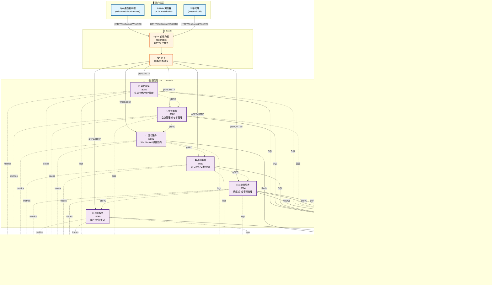

# 🎥 智能会议系统 - Meeting System

[](https://opensource.org/licenses/MIT)
[](https://golang.org/)
[](https://isocpp.org/)
[](https://www.docker.com/)
[](https://webrtc.org/)
[](https://www.qt.io/)

基于 SFU 架构的企业级智能音视频会议系统，集成分布式 AI 推理框架，提供实时 AI 检测、音视频增强、智能分析等功能。
## ⚠️ 应对真实安全威胁场景

近年来，深度伪造（Deepfake）技术与虚拟替身应用的泛滥，已对视频会议安全造成严重威胁。  
例如，[真实案例：被骗 2 亿港元——多人视频会议中只有自己是真人](https://www.bilibili.com/video/BV1mt421b7RV/?spm_id_from=333.337.search-card.all.click&vd_source=c9b42656d48ebc4dbdac35c71fd13723)，显示传统会议系统在身份验证和内容可信性方面存在巨大漏洞。

本系统通过集成 **AI 实时检测与多维身份验证机制**（包括人脸活体识别、声纹识别、视频一致性校验等），  
可在会议过程中实时识别伪造画面与异常音视频信号，  
有效防止“AI 伪装参会”、“虚假发言人”等安全风险，  
为企业级通信提供更高可信度的保障。

## 🏗️ 系统架构



**📖 详细架构说明**: 查看 [系统架构图文档](meeting-system/docs/ARCHITECTURE_DIAGRAM.md)

## ✨ 核心特性

### 🎯 音视频会议
- **SFU 架构**: 基于 Selective Forwarding Unit 的高效媒体路由
- **WebRTC 通信**: 低延迟 P2P 和多方音视频通话
- **实时信令**: WebSocket 信令服务器处理连接协商
- **媒体处理**: FFmpeg 音视频编解码和处理
- **屏幕共享**: 支持桌面和应用程序共享
- **会议录制**: 支持多种格式的会议录制和回放

### 🤖 AI 智能功能
- **语音识别 (ASR)**: 实时语音转文字，支持多语言
- **情感检测**: 基于音频和面部表情的情感分析
- **音频降噪**: AI 驱动的实时音频质量优化
- **视频增强**: 智能视频质量提升和美颜
- **合成检测**: 检测参会者是否为数字人 (Deepfake Detection)
- **智能摘要**: 会议内容自动总结和分析

### 🎨 视频特效
- **实时滤镜**: OpenCV + OpenGL 实现的视频滤镜
- **虚拟背景**: AI 背景分割和替换
- **美颜功能**: 实时面部美化和调整
- **贴图特效**: 动态贴图和虚拟形象

### 🔒 安全与认证
- **JWT 认证**: 基于 Token 的用户认证
- **权限管理**: 细粒度的角色权限控制
- **数据加密**: 端到端加密通信
- **安全审计**: 完整的操作日志记录
- **CSRF 保护**: 跨站请求伪造防护
- **限流防护**: API 速率限制和 DDoS 防护

### 📊 可观测性
- **Prometheus 监控**: 完整的系统指标收集
- **Grafana 可视化**: 实时仪表板和告警
- **Jaeger 追踪**: 分布式链路追踪
- **Loki 日志**: 日志聚合和查询

## 🛠️ 技术栈

### 后端技术
| 技术 | 版本 | 用途 |
|------|------|------|
| **Go** | 1.24.0+ | 主要开发语言 |
| **Gin** | 1.9.1+ | HTTP Web 框架 |
| **GORM** | 1.25+ | ORM 数据库框架 |
| **gRPC** | 1.50+ | 微服务间通信 |
| **PostgreSQL** | 14+ | 主数据库 |
| **Redis** | 7.0+ | 缓存和消息队列 |
| **MongoDB** | 5.0+ | AI 数据存储 |
| **MinIO** | 最新 | 对象存储 |

### 前端技术
| 技术 | 用途 |
|------|------|
| **Qt6** | 跨平台桌面客户端 |
| **QML** | 用户界面设计 |
| **WebRTC** | 音视频通信 |
| **OpenCV** | 视频处理和特效 |

### 部署技术
| 技术 | 用途 |
|------|------|
| **Docker** | 容器化 |
| **Docker Compose** | 容器编排 |
| **Nginx** | 负载均衡和反向代理 |
| **Prometheus** | 系统监控 |
| **Grafana** | 可视化仪表板 |
| **Jaeger** | 分布式链路追踪 |
| **Loki** | 日志聚合 |

## 🚀 快速开始

### 环境要求
- **Docker** 20.0+
- **Docker Compose** 2.0+
- **Go** 1.24.0+ (开发环境)
- **Qt6** 6.0+ (桌面客户端开发)

### 一键部署
```bash
git clone https://github.com/gugugu5331/VideoCall-System.git
cd VideoCall-System/meeting-system
docker-compose up -d
```

### 访问系统
| 服务 | 地址 |
|------|------|
| **API 网关** | http://localhost:8800 |
| **Grafana** | http://localhost:3000 |
| **Prometheus** | http://localhost:9090 |
| **Jaeger** | http://localhost:16686 |

## 📁 项目结构

```
VideoCall-System/
├── meeting-system/          # 后端服务系统
│   ├── backend/            # Go微服务后端
│   ├── Edge-LLM-Infra/     # AI推理框架
│   ├── docs/               # 文档中心
│   └── docker-compose.yml  # Docker编排文件
└── qt6-client/             # Qt6桌面客户端
```

## 📚 文档

- **[系统架构图](meeting-system/docs/ARCHITECTURE_DIAGRAM.md)** - 详细的系统架构说明
- **[API 文档](meeting-system/docs/API/README.md)** - API 接口参考
- **[部署指南](meeting-system/docs/DEPLOYMENT/README.md)** - 部署和配置
- **[开发指南](meeting-system/docs/DEVELOPMENT/README.md)** - 开发和测试
- **[客户端文档](meeting-system/docs/CLIENT/README.md)** - 客户端相关

## 📊 性能指标

- **并发用户**: 支持 1000+ 并发用户
- **会议规模**: 单会议支持 100+ 参与者
- **延迟**: 端到端延迟 < 200ms
- **可用性**: 99.9% 系统可用性

## 🤝 贡献指南

1. Fork 项目
2. 创建特性分支 (`git checkout -b feature/AmazingFeature`)
3. 提交更改 (`git commit -m 'Add some AmazingFeature'`)
4. 推送到分支 (`git push origin feature/AmazingFeature`)
5. 开启 Pull Request

## 📄 许可证

本项目采用 MIT 许可证 - 查看 [LICENSE](LICENSE) 文件了解详情。

## 🙏 致谢

- [Edge-LLM-Infra](https://github.com/gugugu5331/Edge-LLM-Infra) - 分布式AI推理框架
- [WebRTC](https://webrtc.org/) - 实时通信技术
- [Go](https://golang.org/) - 后端开发语言
- [Qt](https://www.qt.io/) - 跨平台GUI框架

## 📞 联系我们

- 项目主页: https://github.com/gugugu5331/VideoCall-System
- 问题反馈: https://github.com/gugugu5331/VideoCall-System/issues
- 邮箱: gugugu5331@example.com

---

⭐ 如果这个项目对你有帮助，请给我们一个星标！

