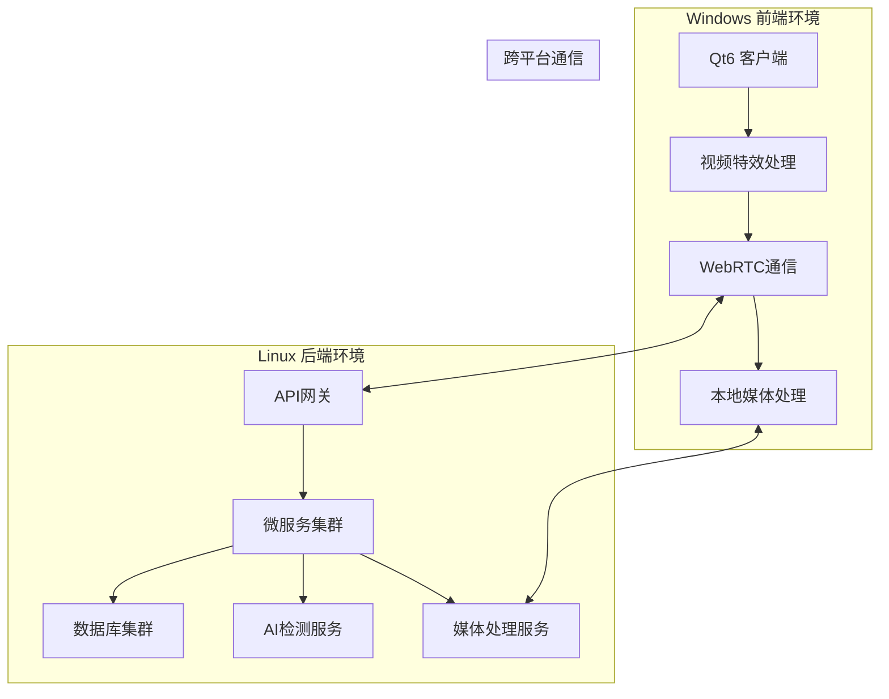

# VideoCall System - 跨平台部署指南

## 📋 概述

本指南详细说明如何在Windows前端和Linux后端环境中部署VideoCall System智能在线会议系统。

## 🏗️ 架构概览



## 🖥️ Windows 前端部署

### 系统要求

- **操作系统**: Windows 10/11 (64-bit)
- **内存**: 8GB RAM (推荐16GB)
- **显卡**: 支持OpenGL 3.3+的独立显卡
- **存储**: 2GB可用空间
- **网络**: 稳定的互联网连接

### 环境准备

#### 1. 安装开发环境

```powershell
# 运行环境设置脚本
.\scripts\cross-platform\setup_development_environment.ps1 -All
```

#### 2. 手动安装依赖（如果自动安装失败）

**Qt6安装**:
```powershell
# 下载Qt6在线安装器
# https://www.qt.io/download-qt-installer
# 选择Qt 6.5.0 MSVC 2019 64-bit
```

**OpenCV安装**:
```powershell
# 使用vcpkg安装OpenCV
git clone https://github.com/Microsoft/vcpkg.git C:\vcpkg
cd C:\vcpkg
.\bootstrap-vcpkg.bat
.\vcpkg integrate install
.\vcpkg install opencv4[contrib,nonfree]:x64-windows
```

**Visual Studio Build Tools**:
```powershell
# 下载并安装VS Build Tools
# https://visualstudio.microsoft.com/downloads/#build-tools-for-visual-studio-2022
```

### 构建前端

#### 1. 配置环境变量

```powershell
# 设置Qt6路径
$env:Qt6_DIR = "C:\Qt\6.5.0\msvc2019_64"

# 设置OpenCV路径
$env:OpenCV_DIR = "C:\vcpkg\installed\x64-windows"

# 设置CMake工具链
$env:CMAKE_TOOLCHAIN_FILE = "C:\vcpkg\scripts\buildsystems\vcpkg.cmake"
```

#### 2. 构建项目

```powershell
# 使用PowerShell构建脚本
cd src\frontend\qt-client-new
.\scripts\build_effects_demo.sh --release

# 或使用Python跨平台构建脚本
python scripts\cross-platform\cross_platform_build.py --platform windows --component frontend --build-type release
```

#### 3. 运行应用

```powershell
cd build-windows\Release
.\VideoEffectsDemo.exe
```

### 部署配置

#### 1. 创建部署包

```powershell
# 创建部署目录
mkdir VideoCallSystem-Windows
cd VideoCallSystem-Windows

# 复制可执行文件
copy ..\build-windows\Release\*.exe .

# 复制Qt6依赖
windeployqt.exe VideoCallSystemClient.exe

# 复制OpenCV依赖
copy "C:\vcpkg\installed\x64-windows\bin\opencv_*.dll" .

# 复制资源文件
xcopy ..\resources resources\ /E /I
```

#### 2. 创建安装程序

使用NSIS或Inno Setup创建Windows安装程序：

```nsis
; VideoCallSystem.nsi
!define APPNAME "VideoCall System"
!define VERSION "1.0.0"

OutFile "VideoCallSystem-Setup.exe"
InstallDir "$PROGRAMFILES64\VideoCallSystem"

Section "MainSection" SEC01
    SetOutPath "$INSTDIR"
    File /r "VideoCallSystem-Windows\*"
    
    CreateDirectory "$SMPROGRAMS\VideoCall System"
    CreateShortCut "$SMPROGRAMS\VideoCall System\VideoCall System.lnk" "$INSTDIR\VideoCallSystemClient.exe"
    CreateShortCut "$DESKTOP\VideoCall System.lnk" "$INSTDIR\VideoCallSystemClient.exe"
SectionEnd
```

## 🐧 Linux 后端部署

### 系统要求

- **操作系统**: Ubuntu 20.04+ / CentOS 8+ / RHEL 8+
- **CPU**: 4核心 (推荐8核心)
- **内存**: 8GB RAM (推荐16GB)
- **存储**: 50GB可用空间
- **网络**: 稳定的互联网连接和固定IP

### 环境准备

#### 1. 运行环境设置脚本

```bash
# 下载并运行Linux环境设置脚本
chmod +x scripts/cross-platform/setup_backend_linux.sh
./scripts/cross-platform/setup_backend_linux.sh --all
```

#### 2. 手动安装依赖（如果需要）

**Go语言环境**:
```bash
# 下载Go 1.21.5
wget https://golang.org/dl/go1.21.5.linux-amd64.tar.gz
sudo tar -C /usr/local -xzf go1.21.5.linux-amd64.tar.gz

# 设置环境变量
echo 'export PATH=$PATH:/usr/local/go/bin' >> ~/.bashrc
echo 'export GOPATH=$HOME/go' >> ~/.bashrc
source ~/.bashrc
```

**数据库安装**:
```bash
# PostgreSQL
sudo apt-get install postgresql postgresql-contrib

# Redis
sudo apt-get install redis-server

# MongoDB
wget -qO - https://www.mongodb.org/static/pgp/server-6.0.asc | sudo apt-key add -
echo "deb [ arch=amd64,arm64 ] https://repo.mongodb.org/apt/ubuntu focal/mongodb-org/6.0 multiverse" | sudo tee /etc/apt/sources.list.d/mongodb-org-6.0.list
sudo apt-get update
sudo apt-get install mongodb-org
```

### 构建后端

#### 1. 构建Go微服务

```bash
# 使用构建脚本
./build-backend.sh release

# 或使用Python跨平台构建脚本
python3 scripts/cross-platform/cross_platform_build.py --platform linux --component backend --build-type release
```

#### 2. 构建AI检测服务

```bash
# 构建AI检测服务
python3 scripts/cross-platform/cross_platform_build.py --component ai --clean
```

### 服务配置

#### 1. 数据库配置

**PostgreSQL配置**:
```bash
# 创建数据库和用户
sudo -u postgres psql
CREATE DATABASE videocall_system;
CREATE USER videocall_user WITH PASSWORD 'your_password';
GRANT ALL PRIVILEGES ON DATABASE videocall_system TO videocall_user;
\q

# 导入数据库结构
psql -U videocall_user -d videocall_system -f config/database/init.sql
```

**Redis配置**:
```bash
# 编辑Redis配置
sudo nano /etc/redis/redis.conf

# 设置密码
requirepass your_redis_password

# 重启Redis
sudo systemctl restart redis-server
```

#### 2. 创建systemd服务

为每个微服务创建systemd服务文件：

```bash
# 创建用户服务
sudo tee /etc/systemd/system/videocall-user-service.service > /dev/null <<EOF
[Unit]
Description=VideoCall System User Service
After=network.target postgresql.service

[Service]
Type=simple
User=videocall
WorkingDirectory=/opt/videocall-system
ExecStart=/opt/videocall-system/build-linux/user-service
Restart=always
RestartSec=5
Environment=GO_ENV=production

[Install]
WantedBy=multi-user.target
EOF

# 启用并启动服务
sudo systemctl enable videocall-user-service
sudo systemctl start videocall-user-service
```

#### 3. 配置Nginx反向代理

```nginx
# /etc/nginx/sites-available/videocall-system
upstream backend {
    server 127.0.0.1:8080;
}

upstream ai_detection {
    server 127.0.0.1:8085;
}

server {
    listen 80;
    server_name api.videocall.com;
    
    # API网关
    location /api/ {
        proxy_pass http://backend;
        proxy_set_header Host $host;
        proxy_set_header X-Real-IP $remote_addr;
        proxy_set_header X-Forwarded-For $proxy_add_x_forwarded_for;
        proxy_set_header X-Forwarded-Proto $scheme;
    }
    
    # AI检测服务
    location /ai/ {
        proxy_pass http://ai_detection;
        proxy_set_header Host $host;
        proxy_set_header X-Real-IP $remote_addr;
        proxy_set_header X-Forwarded-For $proxy_add_x_forwarded_for;
        proxy_set_header X-Forwarded-Proto $scheme;
    }
    
    # WebSocket支持
    location /ws/ {
        proxy_pass http://backend;
        proxy_http_version 1.1;
        proxy_set_header Upgrade $http_upgrade;
        proxy_set_header Connection "upgrade";
        proxy_set_header Host $host;
        proxy_set_header X-Real-IP $remote_addr;
        proxy_set_header X-Forwarded-For $proxy_add_x_forwarded_for;
        proxy_set_header X-Forwarded-Proto $scheme;
    }
}
```

## 🐳 Docker部署

### 1. 构建Docker镜像

```bash
# 构建所有服务的Docker镜像
python3 scripts/cross-platform/cross_platform_build.py --component docker

# 或单独构建特定服务
docker build -t videocall-system/backend -f deployment/docker/Dockerfile.backend .
docker build -t videocall-system/ai-detection -f deployment/docker/Dockerfile.ai-detection .
```

### 2. 使用Docker Compose部署

```yaml
# deployment/docker/docker-compose.yml
version: '3.8'

services:
  postgres:
    image: postgres:15
    environment:
      POSTGRES_DB: videocall_system
      POSTGRES_USER: videocall_user
      POSTGRES_PASSWORD: ${POSTGRES_PASSWORD}
    volumes:
      - postgres_data:/var/lib/postgresql/data
      - ./config/database/init.sql:/docker-entrypoint-initdb.d/init.sql
    ports:
      - "5432:5432"

  redis:
    image: redis:7-alpine
    command: redis-server --requirepass ${REDIS_PASSWORD}
    ports:
      - "6379:6379"

  mongodb:
    image: mongo:6
    environment:
      MONGO_INITDB_ROOT_USERNAME: admin
      MONGO_INITDB_ROOT_PASSWORD: ${MONGO_PASSWORD}
    volumes:
      - mongodb_data:/data/db
    ports:
      - "27017:27017"

  backend:
    image: videocall-system/backend
    depends_on:
      - postgres
      - redis
      - mongodb
    environment:
      - GO_ENV=production
      - DB_HOST=postgres
      - REDIS_HOST=redis
      - MONGO_HOST=mongodb
    ports:
      - "8080:8080"

  ai-detection:
    image: videocall-system/ai-detection
    environment:
      - PYTHON_ENV=production
    ports:
      - "8085:8085"
    volumes:
      - ./models:/app/models

  nginx:
    image: nginx:alpine
    depends_on:
      - backend
      - ai-detection
    volumes:
      - ./deployment/nginx/nginx.conf:/etc/nginx/nginx.conf
    ports:
      - "80:80"
      - "443:443"

volumes:
  postgres_data:
  mongodb_data:
```

启动服务：
```bash
cd deployment/docker
docker-compose up -d
```

## 🔧 配置管理

### 环境变量配置

创建`.env`文件：
```bash
# 数据库配置
POSTGRES_PASSWORD=your_postgres_password
REDIS_PASSWORD=your_redis_password
MONGO_PASSWORD=your_mongo_password

# JWT配置
JWT_SECRET=your_jwt_secret_key

# API配置
API_HOST=0.0.0.0
API_PORT=8080

# AI服务配置
AI_MODEL_PATH=/app/models
AI_DETECTION_THRESHOLD=0.8

# 文件存储配置
UPLOAD_PATH=/opt/videocall-system/uploads
MAX_FILE_SIZE=100MB

# 日志配置
LOG_LEVEL=info
LOG_FORMAT=json
```

### 配置文件模板

**后端配置** (`config/backend/config.yaml`):
```yaml
server:
  host: 0.0.0.0
  port: 8080
  read_timeout: 30s
  write_timeout: 30s

database:
  postgres:
    host: localhost
    port: 5432
    database: videocall_system
    username: videocall_user
    password: ${POSTGRES_PASSWORD}
    max_connections: 100
  
  redis:
    host: localhost
    port: 6379
    password: ${REDIS_PASSWORD}
    db: 0
  
  mongodb:
    host: localhost
    port: 27017
    database: videocall_files
    username: admin
    password: ${MONGO_PASSWORD}

jwt:
  secret: ${JWT_SECRET}
  expiration: 24h

cors:
  allowed_origins:
    - "http://localhost:3000"
    - "https://app.videocall.com"
  allowed_methods:
    - GET
    - POST
    - PUT
    - DELETE
  allowed_headers:
    - Content-Type
    - Authorization

logging:
  level: info
  format: json
  output: file
  file_path: /var/log/videocall-system/backend.log
```

## 📊 监控和日志

### 1. 日志配置

**Logrotate配置**:
```bash
# /etc/logrotate.d/videocall-system
/var/log/videocall-system/*.log {
    daily
    missingok
    rotate 30
    compress
    delaycompress
    notifempty
    create 644 videocall videocall
    postrotate
        systemctl reload videocall-* || true
    endscript
}
```

### 2. 监控配置

**Prometheus配置**:
```yaml
# prometheus.yml
global:
  scrape_interval: 15s

scrape_configs:
  - job_name: 'videocall-backend'
    static_configs:
      - targets: ['localhost:8080']
    metrics_path: /metrics
    
  - job_name: 'videocall-ai'
    static_configs:
      - targets: ['localhost:8085']
    metrics_path: /metrics
```

## 🚀 部署脚本

### 自动化部署脚本

```bash
#!/bin/bash
# deploy.sh

set -e

ENVIRONMENT=${1:-staging}
VERSION=${2:-latest}

echo "🚀 部署VideoCall System到 $ENVIRONMENT 环境"

# 拉取最新代码
git pull origin main

# 构建项目
python3 scripts/cross-platform/cross_platform_build.py --platform all --component all --build-type release

# 运行测试
python3 scripts/cross-platform/cross_platform_build.py --test

# 构建Docker镜像
docker-compose -f deployment/docker/docker-compose.yml build

# 部署到目标环境
if [ "$ENVIRONMENT" = "production" ]; then
    docker-compose -f deployment/docker/docker-compose.prod.yml up -d
else
    docker-compose -f deployment/docker/docker-compose.yml up -d
fi

# 健康检查
sleep 30
curl -f http://localhost:8080/health || exit 1

echo "✅ 部署完成！"
```

## 🔒 安全配置

### SSL/TLS配置

```bash
# 生成SSL证书（Let's Encrypt）
sudo certbot --nginx -d api.videocall.com

# 或使用自签名证书（开发环境）
openssl req -x509 -nodes -days 365 -newkey rsa:2048 \
    -keyout /etc/ssl/private/videocall.key \
    -out /etc/ssl/certs/videocall.crt
```

### 防火墙配置

```bash
# Ubuntu/Debian
sudo ufw allow 22/tcp
sudo ufw allow 80/tcp
sudo ufw allow 443/tcp
sudo ufw enable

# CentOS/RHEL
sudo firewall-cmd --permanent --add-service=ssh
sudo firewall-cmd --permanent --add-service=http
sudo firewall-cmd --permanent --add-service=https
sudo firewall-cmd --reload
```

## 📋 故障排除

### 常见问题

1. **Windows前端构建失败**
   - 检查Qt6和OpenCV路径是否正确
   - 确认Visual Studio Build Tools已安装
   - 检查环境变量设置

2. **Linux后端服务启动失败**
   - 检查数据库连接
   - 确认端口未被占用
   - 查看服务日志：`journalctl -u videocall-user-service`

3. **跨平台通信问题**
   - 检查防火墙设置
   - 确认网络连通性
   - 验证API端点配置

### 日志查看

```bash
# 查看系统服务日志
sudo journalctl -u videocall-user-service -f

# 查看应用日志
tail -f /var/log/videocall-system/backend.log

# 查看Docker容器日志
docker-compose logs -f backend
```

## 📞 技术支持

如果在部署过程中遇到问题，请：

1. 查看相关日志文件
2. 检查系统资源使用情况
3. 验证网络连接和防火墙设置
4. 参考故障排除部分
5. 联系技术支持团队

---

**VideoCall System** - 专业的跨平台智能在线会议解决方案
