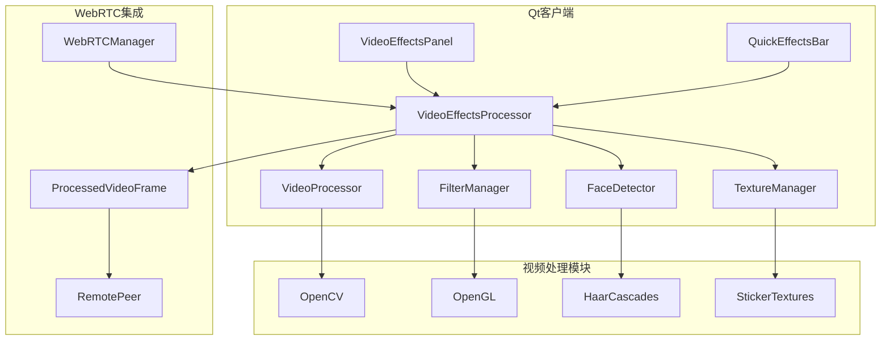

# 🎨 视频特效集成指南

## 概述

本指南详细介绍如何将滤镜、贴图、人脸检测等视频特效功能集成到智能在线会议系统中。

## 🏗️ 架构设计

### 核心组件



### 数据流

1. **摄像头输入** → VideoEffectsProcessor
2. **特效处理** → 滤镜 → 人脸检测 → 贴图渲染 → 背景处理
3. **输出** → WebRTC发送 / 本地显示

## 🚀 快速开始

### 1. 环境准备

```bash
# 安装依赖
sudo apt-get install qt6-base-dev qt6-multimedia-dev
sudo apt-get install libopencv-dev libgl1-mesa-dev

# Windows (使用vcpkg)
vcpkg install qt6 opencv4 opengl

# macOS (使用Homebrew)
brew install qt6 opencv
```

### 2. 构建演示应用

```bash
cd src/frontend/qt-client-new
mkdir build && cd build

# 配置CMake
cmake -DCMAKE_BUILD_TYPE=Release -f ../CMakeLists_effects_demo.txt ..

# 构建
make -j$(nproc)

# 运行演示
./VideoEffectsDemo
```

### 3. 基本集成

```cpp
#include "media/video_effects_processor.h"

// 创建特效处理器
auto* effectsProcessor = new VideoEffectsProcessor(this);
effectsProcessor->initialize();

// 设置滤镜
effectsProcessor->setFilter(VideoProcessing::FilterType::BEAUTY);
effectsProcessor->setFilterIntensity(0.7f);

// 加载贴纸
effectsProcessor->loadSticker("heart", ":/stickers/heart.png");
effectsProcessor->setActiveSticker("heart");

// 启用面部检测
effectsProcessor->enableFaceDetection(true);

// 处理视频帧
QVideoFrame processedFrame = effectsProcessor->processFrame(inputFrame);
```

## 🎯 功能特性

### 滤镜系统

#### 支持的滤镜类型

| 滤镜类型 | 描述 | 性能影响 | 推荐场景 |
|----------|------|----------|----------|
| **BEAUTY** | 美颜滤镜 | 中等 | 个人会议 |
| **CARTOON** | 卡通化 | 高 | 娱乐会议 |
| **VINTAGE** | 复古风格 | 低 | 艺术展示 |
| **SKETCH** | 素描效果 | 中等 | 创意会议 |
| **BLUR** | 模糊效果 | 低 | 背景虚化 |
| **SHARPEN** | 锐化 | 低 | 清晰度增强 |

#### 滤镜使用示例

```cpp
// 美颜滤镜
effectsProcessor->applyBeautyFilter(0.8f);

// 卡通滤镜
effectsProcessor->applyCartoonFilter(0.6f);

// 自定义滤镜
effectsProcessor->setFilter(VideoProcessing::FilterType::VINTAGE);
effectsProcessor->setFilterIntensity(0.5f);

// 清除所有滤镜
effectsProcessor->clearAllFilters();
```

### 贴图系统

#### 贴图类型

- **静态贴纸**: PNG/JPG图片
- **动态贴纸**: GIF动画 (计划支持)
- **3D模型**: OBJ/FBX模型 (计划支持)

#### 贴图使用示例

```cpp
// 加载贴纸
bool success = effectsProcessor->loadSticker("crown", "/path/to/crown.png");

// 设置活动贴纸
effectsProcessor->setActiveSticker("crown");

// 获取可用贴纸列表
QStringList stickers = effectsProcessor->getAvailableStickers();

// 移除贴纸
effectsProcessor->removeSticker("crown");
```

### 面部检测

#### 检测功能

- **面部边界框**: 检测面部位置
- **关键点检测**: 68点面部特征点
- **面部跟踪**: 多帧连续跟踪
- **表情识别**: 基本表情分析 (计划支持)

#### 面部检测示例

```cpp
// 启用面部检测
effectsProcessor->enableFaceDetection(true);

// 设置检测灵敏度
effectsProcessor->setFaceDetectionSensitivity(0.8f);

// 获取检测结果
QList<FaceInfo> faces = effectsProcessor->getDetectedFaces();

// 处理检测结果
for (const auto& face : faces) {
    qDebug() << "Face detected at:" << face.boundingBox;
    qDebug() << "Confidence:" << face.confidence;
    qDebug() << "Landmarks count:" << face.landmarks.size();
}
```

### 背景处理

#### 背景功能

- **背景替换**: 自定义背景图片
- **背景模糊**: 虚化背景
- **绿幕抠图**: 色彩键控 (计划支持)
- **AI分割**: 深度学习人像分割 (计划支持)

#### 背景处理示例

```cpp
// 启用背景替换
effectsProcessor->enableBackgroundReplacement(true);

// 设置背景图片
effectsProcessor->setBackgroundImage("/path/to/background.jpg");

// 设置背景模糊
effectsProcessor->setBackgroundBlur(0.7f);

// 移除背景效果
effectsProcessor->removeBackground();
```

## 🔧 WebRTC集成

### 集成到WebRTC管道

```cpp
class WebRTCVideoProcessor : public QObject
{
public:
    WebRTCVideoProcessor(VideoEffectsProcessor* effectsProcessor)
        : effectsProcessor_(effectsProcessor) {}
    
    // WebRTC帧处理回调
    void onFrameReady(const QVideoFrame& frame) {
        // 应用特效
        QVideoFrame processedFrame = effectsProcessor_->processFrame(frame);
        
        // 发送到WebRTC
        webrtcManager_->sendVideoFrame(processedFrame);
        
        // 本地显示
        localVideoWidget_->setVideoFrame(processedFrame);
    }
    
private:
    VideoEffectsProcessor* effectsProcessor_;
    WebRTCManager* webrtcManager_;
    QVideoWidget* localVideoWidget_;
};
```

### 性能优化

#### 分辨率适配

```cpp
// 根据网络条件调整处理分辨率
if (networkQuality == NetworkQuality::Poor) {
    effectsProcessor->setProcessingResolution(QSize(320, 240));
} else if (networkQuality == NetworkQuality::Good) {
    effectsProcessor->setProcessingResolution(QSize(640, 480));
} else {
    effectsProcessor->setProcessingResolution(QSize(1280, 720));
}
```

#### GPU加速

```cpp
// 启用GPU加速
effectsProcessor->enableGPUAcceleration(true);

// 检查GPU支持
if (effectsProcessor->isGPUAccelerationEnabled()) {
    qDebug() << "GPU acceleration enabled";
} else {
    qDebug() << "Falling back to CPU processing";
}
```

## 🎨 UI集成

### 特效控制面板

```cpp
// 创建特效面板
auto* effectsPanel = new VideoEffectsPanel(this);
effectsPanel->setVideoEffectsProcessor(effectsProcessor);

// 连接信号
connect(effectsPanel, &VideoEffectsPanel::filterChangeRequested,
        effectsProcessor, &VideoEffectsProcessor::setFilter);

connect(effectsPanel, &VideoEffectsPanel::stickerChangeRequested,
        effectsProcessor, &VideoEffectsProcessor::setActiveSticker);
```

### 快速特效按钮

```cpp
// 创建快速特效栏
auto* quickEffectsBar = new QuickEffectsBar(this);
quickEffectsBar->setVideoEffectsProcessor(effectsProcessor);

// 添加到主界面
mainLayout->addWidget(quickEffectsBar);
```

## 📊 性能监控

### 性能指标

```cpp
// 获取性能指标
auto metrics = effectsProcessor->getPerformanceMetrics();

qDebug() << "Average FPS:" << metrics.averageFPS;
qDebug() << "Processing time:" << metrics.processingTimeMs << "ms";
qDebug() << "Filter time:" << metrics.filterTimeMs << "ms";
qDebug() << "Face detection time:" << metrics.faceDetectionTimeMs << "ms";
qDebug() << "Dropped frames:" << metrics.droppedFrames;
```

### 性能优化建议

#### 1. 分辨率优化
- 低端设备: 320x240
- 中端设备: 640x480  
- 高端设备: 1280x720

#### 2. 帧率控制
- 网络会议: 15-20 FPS
- 高质量会议: 25-30 FPS
- 录制场景: 30-60 FPS

#### 3. 特效组合
- 避免同时使用多个高消耗特效
- 优先使用GPU加速的特效
- 根据设备性能动态调整

## 🔍 故障排除

### 常见问题

#### 1. 初始化失败
```cpp
if (!effectsProcessor->initialize()) {
    QString error = effectsProcessor->lastError();
    qDebug() << "Initialization failed:" << error;
    
    // 检查依赖
    // 检查OpenCV安装
    // 检查OpenGL支持
}
```

#### 2. 性能问题
```cpp
// 监控性能警告
connect(effectsProcessor, &VideoEffectsProcessor::performanceWarning,
        this, [](const QString& warning) {
    qWarning() << "Performance warning:" << warning;
    
    // 自动降低质量
    // 禁用部分特效
    // 提示用户优化设置
});
```

#### 3. 内存泄漏
```cpp
// 正确清理资源
effectsProcessor->cleanup();
delete effectsProcessor;
```

## 📚 API参考

### VideoEffectsProcessor

#### 核心方法
- `bool initialize()` - 初始化处理器
- `QVideoFrame processFrame(const QVideoFrame& frame)` - 处理视频帧
- `void cleanup()` - 清理资源

#### 滤镜控制
- `void setFilter(FilterType type)` - 设置滤镜类型
- `void setFilterIntensity(float intensity)` - 设置滤镜强度
- `void clearAllFilters()` - 清除所有滤镜

#### 贴图控制
- `bool loadSticker(const QString& name, const QString& path)` - 加载贴纸
- `void setActiveSticker(const QString& name)` - 设置活动贴纸
- `QStringList getAvailableStickers()` - 获取可用贴纸列表

#### 面部检测
- `void enableFaceDetection(bool enable)` - 启用面部检测
- `QList<FaceInfo> getDetectedFaces()` - 获取检测结果

#### 背景处理
- `void enableBackgroundReplacement(bool enable)` - 启用背景替换
- `void setBackgroundImage(const QString& path)` - 设置背景图片
- `void setBackgroundBlur(float intensity)` - 设置背景模糊

### VideoEffectsPanel

#### UI控制
- `void setVideoEffectsProcessor(VideoEffectsProcessor* processor)` - 设置处理器
- `void showPanel(bool show)` - 显示/隐藏面板

#### 预设管理
- `void loadPresets()` - 加载预设
- `void saveCurrentAsPreset(const QString& name)` - 保存当前设置为预设

## 🚀 高级功能

### 自定义滤镜

```cpp
// 创建自定义滤镜
class CustomFilter : public FilterBase {
public:
    cv::Mat apply(const cv::Mat& input) override {
        cv::Mat output;
        // 自定义滤镜逻辑
        return output;
    }
};

// 注册自定义滤镜
effectsProcessor->registerCustomFilter("my_filter", new CustomFilter());
```

### 插件系统

```cpp
// 加载特效插件
effectsProcessor->loadPlugin("/path/to/effects_plugin.so");

// 获取插件提供的特效
QStringList pluginEffects = effectsProcessor->getPluginEffects();
```

## 📈 未来规划

### 计划功能
- [ ] 实时换脸技术
- [ ] AR虚拟物体
- [ ] 手势识别
- [ ] 语音驱动动画
- [ ] 多人协同特效
- [ ] 云端特效处理

### 性能优化
- [ ] WebAssembly支持
- [ ] 移动端优化
- [ ] 硬件编码集成
- [ ] 分布式处理

## 🤝 贡献指南

欢迎贡献新的特效、优化建议和bug修复！

1. Fork项目
2. 创建特性分支
3. 提交更改
4. 创建Pull Request

## 📄 许可证

本项目采用MIT许可证 - 查看 [LICENSE](../../LICENSE) 文件了解详情。
