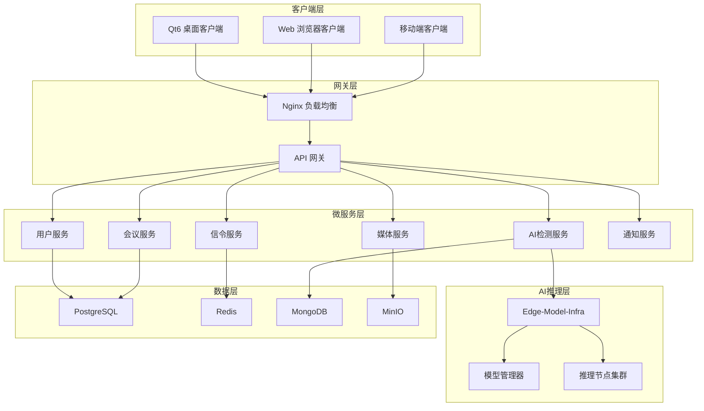

# 🎯 智能视频会议平台项目状态分析报告

**文档版本**: v1.0  
**创建时间**: 2025-09-29  
**最后更新**: 2025-09-29  
**维护者**: 开发团队  
**文档类型**: 进度报告  

---

## 📋 文档概览

### 目的
本报告旨在全面分析智能视频会议平台项目的当前状态，包括技术架构分析、开发进度评估和下一阶段开发计划。

### 读者对象
- 项目管理团队
- 开发团队成员
- 架构师和技术负责人
- 产品经理

### 先决条件
- 熟悉项目基本架构
- 了解微服务开发模式
- 具备AI推理框架基础知识

---

## 📊 项目概览

### 项目背景
本项目是一款集成AI服务的智能视频会议平台，旨在提高在线会议安全性，采用微服务架构，集成多人在线会议、屏幕共享、音视频质量优化等功能。

### 核心技术栈

#### 后端技术栈
- **微服务框架**: Go (Gin + GORM)
- **通信协议**: gRPC + HTTP + WebRTC
- **数据库**: PostgreSQL + Redis + MongoDB + MinIO
- **消息队列**: ZeroMQ
- **容器化**: Docker + Nginx

#### AI推理技术栈
- **开发语言**: C++
- **通信框架**: ZeroMQ
- **架构模式**: 主从Reactor模式、分布式架构
- **设计模式**: 工厂模式、观察者模式
- **构建工具**: CMake
- **事件引擎**: eventpp

#### 媒体处理技术栈
- **音视频编解码**: FFmpeg
- **图像处理**: OpenCV
- **图形渲染**: OpenGL
- **通信协议**: WebRTC (SFU架构)

#### 前端技术栈
- **桌面客户端**: Qt6
- **Web客户端**: React/Vue (规划中)
- **移动端**: 跨平台方案 (规划中)

---

## 🏗️ 系统架构设计

### 整体架构图

### Edge-LLM-Infra 架构详解

#### 核心组件

1. **unit-manager** (全局节点管理中心)
   - 系统级服务发现
   - 按action路由动态分发任务
   - 轻量化内存KV缓存数据库
   - 多协议网关 (TCP/ZMQ协议转换)
   - 主从多Reactor TCP通信框架

2. **StackFlow** (业务层接口框架)
   - LM类管理多个TASK类
   - eventpp异步事件引擎
   - 标准化虚函数接口
   - workid-channel连接池管理
   - weak_ptr解决循环引用

3. **Channel信道管理**
   - 统一管理多模式ZMQ连接
   - 动态URL绑定
   - 观察者模式+闭包回调
   - 标准化JSON协议格式

4. **混合通信组件**
   - 基于ZeroMQ封装 (PUB/SUB、PUSH/PULL、REQ/REP)
   - 工厂模式统一创建
   - RPC方法注册和超时处理
   - 约70%代码简化率

---

## 📈 项目进度分析

### 当前完成情况

#### ✅ 已完成部分 (40%整体进度)

##### 1. Edge-LLM-Infra框架 (90%完成)
- ✅ **StackFlow核心框架**: 完整的C++基础设施
- ✅ **Channel管理系统**: ZMQ通信管理
- ✅ **unit-manager**: 节点管理和任务分发
- ✅ **构建系统**: CMake配置和Docker化
- ✅ **事件驱动架构**: eventpp异步处理

##### 2. 会议系统后端微服务 (70%完成)

###### 用户服务 (100%完成)
- ✅ 用户注册/登录 (bcrypt密码加密)
- ✅ JWT认证系统 (完整中间件)
- ✅ 权限管理 (5级用户角色)
- ✅ 用户资料管理
- ✅ 17个REST API接口

###### 会议服务 (100%完成)
- ✅ 会议创建/删除/更新
- ✅ 会议参与管理
- ✅ 会议录制功能
- ✅ 参与者管理
- ✅ 28个REST API接口

###### 共享库 (100%完成)
- ✅ 配置管理 (config)
- ✅ 日志系统 (logger)
- ✅ 数据库集成 (database)
- ✅ 工具库 (utils)
- ✅ 中间件 (middleware)
- ✅ ZMQ桥接框架

##### 3. 数据库集成 (100%完成)
- ✅ **PostgreSQL**: 主数据库，GORM集成
- ✅ **Redis**: 缓存系统，会话管理
- ✅ **MongoDB**: 文档存储，聊天记录
- ✅ **MinIO**: 对象存储，文件管理

##### 4. AI节点实现 (60%完成)
- ✅ **MeetingAINode框架**: 继承StackFlow
- ✅ **AI任务类型**: 语音识别、情绪识别、音频降噪、视频增强
- ✅ **任务队列系统**: 多线程处理、优先级队列
- ✅ **模型接口**: 标准化AI模型接口
- 🔄 **实际模型**: 需要加载真实AI模型文件

#### 🔄 进行中部分 (30%整体进度)

##### 1. 系统集成测试
- ✅ **功能测试**: 用户服务和会议服务100%通过
- ✅ **压力测试**: 完整的测试脚本和报告
- ✅ **API验证**: 45个REST API接口验证通过
- 🔄 **AI集成测试**: ZMQ通信需要实际连接

##### 2. AI服务集成
- ✅ **协议定义**: 标准化JSON协议
- ✅ **Go-ZMQ客户端**: 完整接口定义
- 🔄 **实际ZMQ连接**: 当前为模拟模式
- 🔄 **模型部署**: 需要部署实际AI模型

#### ❌ 缺失部分 (30%整体进度)

##### 1. 关键微服务缺失
- ❌ **信令服务**: WebRTC信令处理
- ❌ **媒体服务**: SFU媒体路由
- ❌ **AI检测服务**: AI功能集成服务  
- ❌ **通知服务**: 实时通知推送
- ❌ **API网关**: 统一入口和负载均衡

##### 2. 前端客户端
- ❌ **Qt6桌面客户端**: 音视频会议界面
- ❌ **Web浏览器客户端**: React/Vue前端
- ❌ **Web管理界面**: 系统管理后台

##### 3. 音视频处理
- ❌ **FFmpeg集成**: 音视频编解码
- ❌ **OpenCV处理**: 滤镜、美颜功能
- ❌ **OpenGL渲染**: 图形加速
- ❌ **WebRTC实现**: P2P和SFU通信

##### 4. 部署优化
- ❌ **Nginx配置**: API网关、负载均衡
- ❌ **Kubernetes部署**: 生产环境编排
- ❌ **监控系统**: 性能监控和告警

---

## 🚀 开发路线图

### 第一阶段: AI服务集成完善 (1-2周)

**目标**: 打通AI推理服务，实现完整的Go微服务与Edge-LLM-Infra集成

#### 关键任务
1. **ZMQ桥接完善**
   - 修复Go-ZMQ客户端实际连接逻辑
   - 替换当前的模拟模式
   - 实现真实的ZMQ通信

2. **AI服务部署**
   - 部署Edge-LLM-Infra的unit-manager
   - 部署MeetingAINode推理节点
   - 配置服务发现和任务分发

3. **集成测试**
   - 端到端AI服务流程测试
   - JSON协议和数据传输验证
   - 性能和稳定性测试

#### 预期产出
- 功能完整的AI推理服务
- 语音识别、情绪识别等AI功能可用
- 完整的测试报告和文档

### 第二阶段: 核心微服务补全 (2-3周)

**目标**: 实现完整的微服务架构

#### 信令服务开发
- WebSocket连接管理
- WebRTC信令协议实现
- 房间状态管理
- 参与者状态同步

#### 媒体服务(SFU)开发
- SFU媒体路由实现
- WebRTC媒体流处理
- 音视频转发和混合
- 带宽自适应算法

#### AI检测服务开发
- 集成Edge-LLM-Infra调用
- 实时音视频流AI处理
- AI结果缓存和推送
- 性能优化策略

### 第三阶段: 前端客户端开发 (3-4周)

**目标**: 提供完整的用户交互界面

#### Web客户端
- React/Vue前端框架搭建
- WebRTC音视频功能集成
- 实时聊天界面开发
- AI功能展示界面

#### Qt6桌面客户端
- 音视频会议界面设计
- OpenGL图形渲染集成
- 本地音视频处理
- 跨平台适配优化

### 第四阶段: 音视频处理集成 (2-3周)

**目标**: 实现专业级音视频处理能力

#### FFmpeg集成
- 音视频编解码实现
- 多格式转换支持
- 流媒体处理优化
- 会议录制功能

#### OpenCV + OpenGL处理
- 实时美颜滤镜开发
- 虚拟背景技术
- 图像增强算法
- GPU加速优化

### 第五阶段: 系统部署与优化 (1-2周)

**目标**: 生产环境就绪

#### 部署优化
- Nginx配置优化
- Docker容器编排
- Kubernetes生产部署
- 监控告警系统搭建

---

## 📊 技术债务与风险评估

### 技术债务
1. **AI模型集成**: 当前使用模拟数据，需要集成真实AI模型
2. **ZMQ连接**: Go客户端需要实现真实的ZMQ通信
3. **WebRTC实现**: 需要完整的WebRTC协议栈实现
4. **性能优化**: 大规模并发下的性能调优

### 风险点
1. **AI模型性能**: 实时推理的延迟和准确性
2. **网络通信**: WebRTC在复杂网络环境下的稳定性
3. **系统扩展**: 大规模用户并发的架构挑战
4. **开发周期**: 前端开发可能影响整体进度

### 缓解策略
1. **分阶段验证**: 每个阶段都进行完整的功能验证
2. **性能监控**: 建立完善的监控和告警机制
3. **负载测试**: 定期进行压力测试和性能调优
4. **文档管理**: 建立完善的技术文档体系

---

## 🎯 近期行动建议

### 立即执行 (本周内)
1. **激活AI服务**: 修复ZMQ客户端连接
2. **部署验证**: 启动Edge-LLM-Infra服务
3. **集成测试**: 验证端到端AI通信

### 短期目标 (2周内)
1. **WebRTC信令**: 实现基础信令交换
2. **媒体服务**: 搭建SFU基础架构
3. **Web客户端**: 开发简单音视频界面

### 中期目标 (1个月内)
1. **完整微服务**: 补全所有核心微服务
2. **前端原型**: 可用的Web和Qt客户端
3. **AI功能**: 集成所有AI处理能力

---

## 📝 项目优势分析

### 技术架构优势
1. **分布式AI框架**: 企业级AI推理基础设施
2. **微服务基础**: 经过完整测试的服务架构
3. **多数据库支持**: 完整的数据存储解决方案
4. **标准化协议**: 确保组件间互操作性

### 竞争优势
1. **AI+会议集成**: 独特的分布式AI推理在会议系统中的应用
2. **完整技术栈**: 从底层C++到上层Go的完整生态
3. **企业级设计**: 微服务、分布式、容器化的现代架构
4. **高度可扩展**: 支持动态节点管理和水平扩展

---

## 🔄 变更历史

| 版本 | 日期 | 变更内容 | 变更者 |
|------|------|----------|--------|
| v1.0 | 2025-09-29 | 初始版本创建，完整项目状态分析 | 开发团队 |

---

## 📞 联系信息

### 文档维护者
- **姓名**: 开发团队
- **职责**: 项目进度跟踪和状态分析

### 技术支持
如有问题，请通过以下方式联系：
1. 创建GitHub Issue
2. 在团队协作平台提出
3. 参加项目同步会议

---

**重要提醒**: 本报告反映2025年9月29日的项目状态，随着开发进展，相关数据和评估可能发生变化。请定期关注后续进度报告更新。 