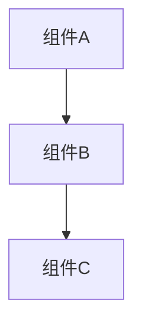

# [文档标题]

**文档版本**: v1.0  
**创建时间**: YYYY-MM-DD  
**最后更新**: YYYY-MM-DD  
**维护者**: [维护者姓名/团队]  
**文档类型**: [架构设计/开发指南/API文档/测试报告/技术笔记]  

---

## 📋 文档概览

### 目的
简要说明本文档的目的和作用范围。

### 读者对象
说明本文档的目标读者群体。

### 先决条件
列出阅读本文档需要的前置知识或条件。

---

## 📖 主要内容

### 章节1: [章节标题]

#### 子章节1.1
内容描述...

#### 子章节1.2
内容描述...

### 章节2: [章节标题]

#### 子章节2.1
内容描述...

---

## 📊 图表和示例

### 架构图示例


### 代码示例
```go
// Go代码示例
func example() {
    fmt.Println("Hello, World!")
}
```

```cpp
// C++代码示例
#include <iostream>
int main() {
    std::cout << "Hello, World!" << std::endl;
    return 0;
}
```

### 配置示例
```yaml
# YAML配置示例
version: '3.8'
services:
  app:
    image: myapp:latest
    ports:
      - "8080:8080"
```

---

## 📝 相关资源

### 相关文档
- [文档链接1](path/to/document1.md)
- [文档链接2](path/to/document2.md)

### 外部资源
- [外部链接1](https://example.com)
- [外部链接2](https://example.com)

### 工具和依赖
- 工具1: 版本x.x.x
- 工具2: 版本x.x.x

---

## 🔄 变更历史

| 版本 | 日期 | 变更内容 | 变更者 |
|------|------|----------|--------|
| v1.0 | YYYY-MM-DD | 初始版本创建 | [姓名] |

---

## 📞 联系信息

### 文档维护者
- **姓名**: [维护者姓名]
- **邮箱**: [email@example.com]
- **职责**: [具体职责范围]

### 技术支持
如有问题，请通过以下方式联系：
1. 创建GitHub Issue
2. 发送邮件至维护者
3. 在团队协作平台提出

---

**注意事项**: 
- 请在使用本模板时删除所有示例内容和说明性文字
- 确保所有链接和引用都是有效的
- 定期更新文档内容以保持准确性 