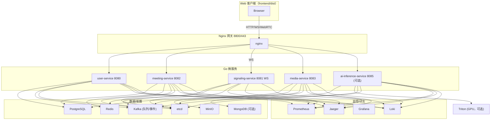
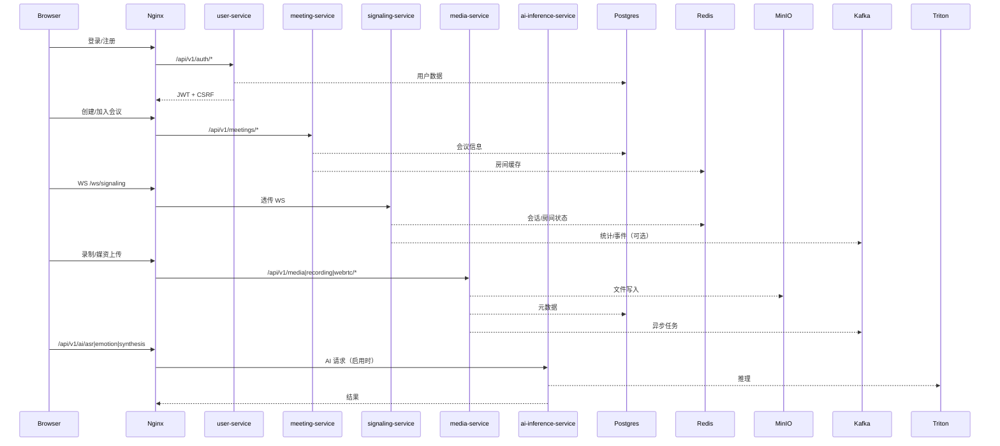
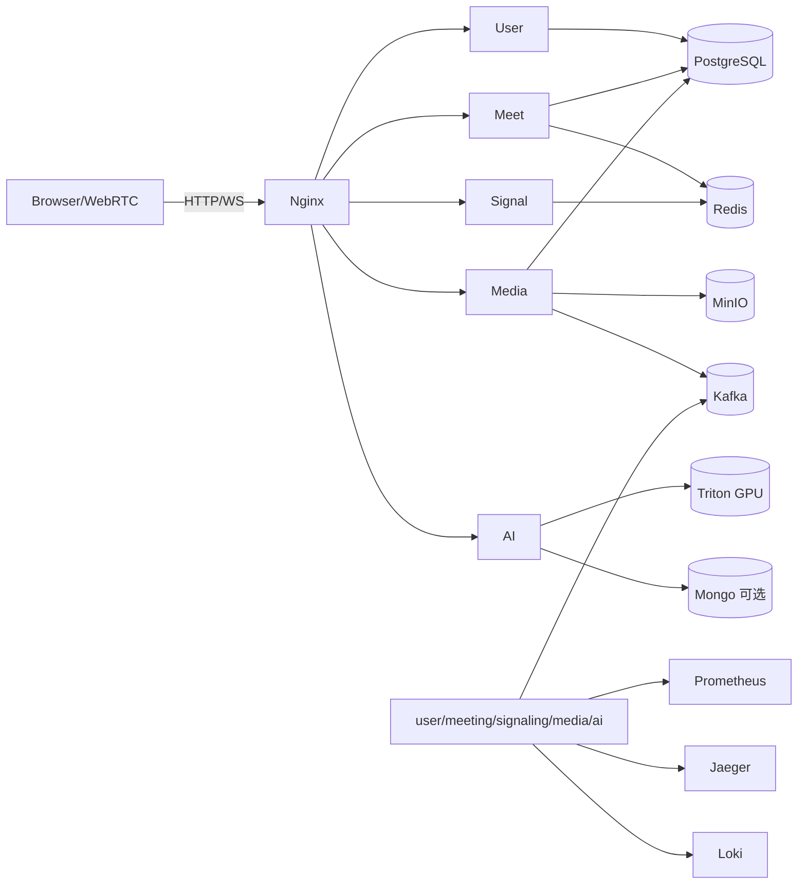

# 🎥 Meeting System - 后端与运维总览

基于 Go 的 WebRTC 会议后端，内置 Nginx 网关、Kafka 队列/事件总线与监控链路，前端已构建在 `frontend/dist` 并随网关同源发布。AI 推理服务可按需接入 Triton（GPU）。

## 前置要求

- Docker 20+、Docker Compose v2+
- CPU 8C/16G 起步；如需 AI + GPU，确保驱动/CUDA 正常
- 端口 8800/443/8801~8805/9000/9001 未被占用

## 快速启动（基础版）

```bash
cd meeting-system
docker compose up -d
```

入口：`http://localhost:8800`。基础 compose 默认未启用 `triton` 与 `ai-inference-service`，以便快速拉起主链路。需要 AI 能力时请参考下方 “AI/多机部署”。

启动后验证：
```bash
docker compose ps
curl http://localhost:8800/health
```

必备环境变量（可写入 `.env`）：
- `JWT_SECRET`：强随机值；不设置将无法通过认证
- `ALLOWED_ORIGINS`：允许的前端来源（逗号分隔）
- TLS 证书放在 `nginx/ssl/`（`fullchain.pem` / `privkey.pem`）
建议同步修改数据库/MinIO/Kafka/Redis 默认凭据，避免生产使用示例账号密码。

示例 `.env` 片段：
```
JWT_SECRET=please-change-me
ALLOWED_ORIGINS=http://localhost:8800
POSTGRES_PASSWORD=change-postgres
MINIO_ROOT_PASSWORD=change-minio
```

## 服务与端口

| 组件 | 端口/入口 | 说明 |
| --- | --- | --- |
| Nginx | 8800/443 | 网关 + 静态前端，WS 透传 |
| user-service | 8080 | 注册/登录、JWT/CSRF、用户管理 |
| signaling-service | 8081 | WebSocket `/ws/signaling`，房间/会话状态 |
| meeting-service | 8082 | 会议/参会者管理、录制元数据 |
| media-service | 8083 | 媒体上传、录制、WebRTC/SFU 辅助接口 |
| ai-inference-service* | 8085 | AI 推理 HTTP/gRPC（ASR/情绪/合成检测） |
| PostgreSQL / Redis / Kafka / MongoDB / MinIO / etcd | 内网 | 默认仅容器内访问 |
| Prometheus / Alertmanager / Jaeger / Grafana / Loki | 8801~8805 | 监控、追踪、日志 |

\* AI 相关组件在基础 compose 注释；远程/独立 GPU 方案见部署文档。

### 关于 Kafka

- 默认使用内置单节点 KRaft（`kafka:9092`）承担任务队列与事件总线，主题前缀 `meeting.*`。
- 如需外部 Kafka，修改 `backend/config/*.yaml` 中的 `kafka.brokers`、`message_queue`、`event_bus`，并在 compose/k8s 中调整环境变量。
- 无 Kafka 时可切换到内存队列（`message_queue.type=memory`），但仅适合单实例开发，不具备持久化与高可用。

## 架构速览



更多链路细节与数据流见 `docs/ARCHITECTURE_DIAGRAM.md` 与 `docs/BACKEND_ARCHITECTURE.md`。

### 数据与调用流（示意）



### 服务交互图（含 Kafka/观测）



交互要点：
- 网关统一入口：HTTP/WS 请求按路径路由到对应微服务，信令 WS 直接透传；AI 路由 `/api/v1/ai/*` 可选开启。
- 数据与状态：Postgres 存储核心业务，Redis 保存房间/会话与限流，MinIO 负责录制/媒资文件，Kafka 用于任务与事件（前缀 `meeting.*`）。
- AI：`ai-inference-service` 连接 Triton GPU，可选使用 Mongo 存储结果；上游可在 Nginx 侧扩展多节点。
- 观测：各服务暴露 `/metrics`，Trace 输出到 Jaeger，日志到 Loki；默认 compose 已集成观测栈。

## 文档导航

- 架构与总览：`docs/ARCHITECTURE_DIAGRAM.md`、`docs/BACKEND_ARCHITECTURE.md`
- API：`docs/API/API_DOCUMENTATION.md`
- 部署：`docs/DEPLOYMENT/README.md`（含远程、GPU AI、K8s）
- 客户端：`docs/CLIENT/README.md`
- 开发与测试：`docs/DEVELOPMENT/README.md`
- 数据：`docs/DATABASE_SCHEMA.md`

## 开发与调试

- 只启动依赖：`docker compose up -d postgres redis kafka etcd minio`
- 本地跑单个服务：`go run . -config=../config/<service>.yaml`
- Web 客户端已打包在 `frontend/dist`；同源访问 `/api/v1/*` 与 `/ws/signaling`。
- 集成测试脚本位于 `backend/tests`；端到端脚本位于 `tests/`。

常用日志与健康检查：
- 网关：`docker compose logs -f nginx`，`curl http://localhost:8800/health`
- 各服务：`docker compose logs -f <service>`，`curl http://localhost:<port>/health`
- Prometheus/Grafana/Jaeger/Loki：访问 8801/8804/8803/8805

## 监控与日志

- 指标：`/metrics` → Prometheus（8801），Grafana 8804 导入现成数据源。
- 追踪：Jaeger UI `http://localhost:8803`。
- 日志：Loki 8805，Promtail 自动收集容器日志。

## AI 与多机部署

- 单机 GPU 节点：`deployment/gpu-ai/docker-compose.gpu-ai.yml`。
- 多节点上游：使用 `nginx/scripts/gen_ai_inference_service_servers_conf.sh` 生成本地 upstream。
- 远程/生产部署：`quick-deploy-remote.sh` 与 `docs/DEPLOYMENT/REMOTE_DEPLOYMENT_GUIDE.md`。

## 故障排查速览

- 入口不可达：`docker compose ps` 检查容器，`docker compose logs -f nginx` 查看网关路由错误。
- 认证失败：确认 `JWT_SECRET` 已设置且前端携带最新 JWT，必要时重新登录。
- AI 报错：验证 `ai-inference-service` 是否启用、Triton `/v2/health/ready` 是否可访问，模型名/路径与配置一致。
- 录制/上传失败：检查 MinIO 凭据与桶名称，确认宿主机磁盘与卷挂载正常。
- Kafka 未消费：检查 `docker compose logs -f kafka`，使用 `kafka-topics.sh --list` 与 `kafka-consumer-groups.sh --describe` 查看主题与滞后；必要时降低到内存队列以排查。

## 架构概要（含 Kafka / K8s）

- **核心栈**：Nginx 统一入口 + Go 微服务（user/meeting/signaling/media/可选 AI），Kafka 为队列与事件总线（`meeting.*`），PostgreSQL/Redis/MinIO 为主要存储，AI 由 `ai-inference-service` + Triton 提供。
- **K8s 部署**：`deployment/k8s/` 含单节点 KRaft Kafka 与临时存储，适合演示；生产请改用外部 Kafka/数据库/对象存储 + PVC + Ingress/证书，并在 `services.yaml` 更新镜像与凭据。
- **扩展建议**：微服务与 AI 节点可多实例部署；Kafka/Redis/Postgres/MinIO 推荐托管或集群；AI upstream 可在 Nginx 侧扩展多 GPU 节点。
