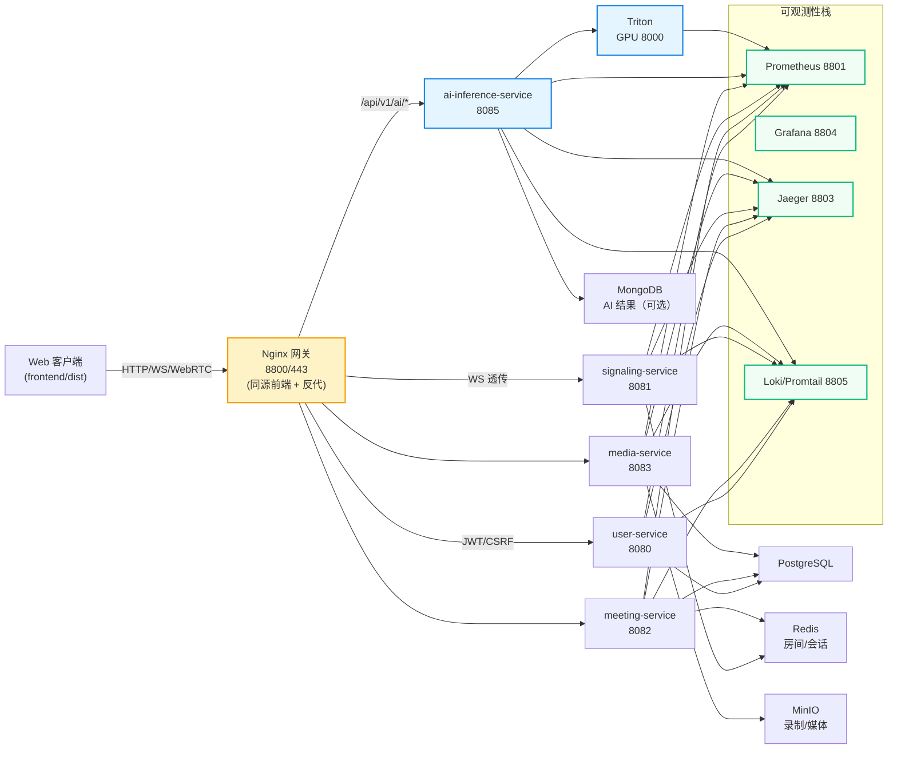

# 🎥 Meeting System - 后端与运维说明

基于 Go 的 WebRTC 会议后端，提供用户/会议/信令/媒体/AI 推理微服务，配套 Nginx 网关、监控链路和预构建的 Web 客户端。

## ⚡ 架构概览（当前代码）

- **网关**：Nginx（HTTP 8800/HTTPS 443，静态前端与反向代理）
- **微服务**：
  - `user-service` (8080) 用户与认证
  - `signaling-service` (8081) WebSocket 信令、房间状态
  - `meeting-service` (8082) 会议与参与者管理
  - `media-service` (8083) 媒体上传/录制元数据、SFU 配套接口
  - `ai-inference-service` (8085) AI 推理，调用 Triton (8000)
- **基础设施**：PostgreSQL、Redis、MongoDB、MinIO、etcd
- **可观测性**：Prometheus (8801)、Alertmanager (8802)、Jaeger (8803)、Grafana (8804)、Loki/Promtail (8805)

完整拓扑与端口以 `docker-compose.yml` 为准，架构图见 `docs/ARCHITECTURE_DIAGRAM.md`。

## 🧠 架构图



### ✨ 创新点

- **实时可信 AI**：内置 AI 推理服务直连 Triton，提供 ASR/情绪/合成检测，浏览器端可一键调用 `/api/v1/ai/*`，用于会议实时鉴伪与字幕标注。
- **同源一体化体验**：Nginx 同时托管前端与网关，WebSocket 信令 `/ws/signaling` 透传，减少 CORS/跨域复杂度。
- **弹性 AI 上游**：Nginx 通过 `include conf.d/ai_inference_service.servers*.conf` 动态扩展多台 GPU 节点，无需改动代码。
- **可观测性开箱即用**：Prometheus/Grafana/Jaeger/Loki 在默认 Compose 中启用，所有服务暴露 `/metrics` 和 trace/log，便于快速定位质量问题。
- **安全基线内置**：JWT + CSRF Token、限流/CORS 环境变量、MinIO 私有存储与 etcd 服务发现全部预置在配置与示例 Compose 中。

## 🚀 一键启动

```bash
cd meeting-system
docker compose up -d
docker compose ps
```

默认暴露：
- Web & API：`http://localhost:8800`
- AI 服务直连：`http://localhost:8085`
- Prometheus/Grafana/Jaeger：`http://localhost:8801/8804/8803`
- MinIO 控制台：`http://localhost:9001`（`minioadmin/minioadmin`）

> 设置环境变量 `JWT_SECRET`（必须）、`ALLOWED_ORIGINS`、自签或正式证书放在 `nginx/ssl/`。

## 📂 目录速览

- `backend/`：Go 微服务与共享库
- `frontend/dist`：已编译的 Web 客户端（由 Nginx 提供）
- `docs/`：架构、API、部署、客户端与开发文档
- `nginx/`：网关配置与 AI 上游模板
- `monitoring/`：Prometheus/Grafana/Loki 配置
- `deployment/`：GPU AI 远端/多机部署示例
- `scripts/`、`download_models*.py`：运维与模型下载脚本

## 🔌 主要服务与接口

| 服务 | 端口 | 关键接口（节选） | 配置 |
|------|------|------------------|------|
| user-service | 8080 | `/api/v1/auth/{register,login,refresh}`, `/api/v1/users/profile`, `/api/v1/admin/users` | `backend/config/config.yaml` |
| meeting-service | 8082 | `/api/v1/meetings` CRUD、`/api/v1/meetings/:id/{join,leave,recording/*}`、`/api/v1/my/*` | `backend/config/meeting-service.yaml` |
| signaling-service | 8081 | `GET /ws/signaling`、`/api/v1/sessions/*`、`/api/v1/stats/*` | `backend/config/signaling-service.yaml` |
| media-service | 8083 | `/api/v1/media/*`、`/api/v1/recording/*`、`/api/v1/webrtc/*`、`/api/v1/ai/*`(状态) | `backend/config/media-service.yaml` |
| ai-inference-service | 8085 (HTTP) | `/api/v1/ai/{asr,emotion,synthesis,setup,batch,health,info,analyze}` | `backend/ai-inference-service/config/ai-inference-service.yaml` |

统一通过网关访问：`http://localhost:8800`（同源请求），WebSocket 信令走 `/ws/signaling`。

## 🛠️ 开发与本地调试

1) 拉起基础设施：
```bash
docker compose up -d postgres redis mongodb minio etcd jaeger
```

2) 启动某个服务（示例 user-service）：
```bash
cd backend/user-service
go run . -config=../config/config.yaml
```

3) Web 客户端使用同源 API；如需直连服务，可调整浏览器地址指向对应端口。

## 🧪 测试

`backend/tests` 提供覆盖网关与微服务的脚本：
- `./run_all_tests.sh`：完整集成测试
- `./quick_integration_test.sh`：快速连通性检查
- `./test_nginx_gateway.sh`：网关路由校验

根据需要先启动依赖容器，再运行脚本。无预置的最新测试时间戳，请按需执行。

## 📊 监控与日志

- 指标：`/metrics`（各服务） → Prometheus 8801
- 追踪：Jaeger UI `http://localhost:8803`
- 日志：Loki 8805（在 Grafana Explore 查询）

## 📚 相关文档

- 文档索引：`docs/README.md`
- 架构：`docs/ARCHITECTURE_DIAGRAM.md`
- API：`docs/API/API_DOCUMENTATION.md`
- 部署：`docs/DEPLOYMENT/README.md`
- 开发/测试：`docs/DEVELOPMENT/README.md`
- 客户端：`docs/CLIENT/README.md`
