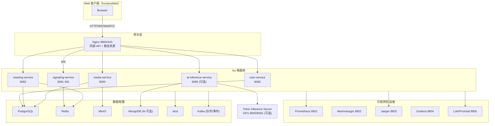

# 🏗️ 系统架构图

## 总体拓扑

> 默认 `docker-compose.yml` 注释了 AI 相关容器；`docker-compose.remote.yml` 与 `deployment/gpu-ai/docker-compose.gpu-ai.yml` 可启用 Triton + `ai-inference-service`。

## 关键要点

- **前端**：仅包含已构建的 Web 客户端，Nginx 同源托管。
- **信令/媒体**：WebSocket `/ws/signaling` 维持房间状态；WebRTC 媒体点对点/SFU 协商，录制与媒资由 `media-service` 处理，元数据入 Postgres、文件入 MinIO。Redis 维护房间/会话，Kafka 用于异步任务/事件。
- **AI**：`/api/v1/ai/*` 由 `ai-inference-service` 转发/直连 Triton，可通过 Nginx upstream 扩展多 GPU 节点。
- **队列/事件**：Kafka 取代 Redis 队列，主题前缀 `meeting.*`。
- **可观测性**：所有服务提供 `/metrics`，Jaeger 追踪，Loki 收集容器日志。

### 主要服务与依赖（精简）

- **user-service**：认证/JWT/CSRF，依赖 Postgres、Redis、etcd、Kafka（可选），端口 8080。
- **meeting-service**：会议/参会者/录制元数据，依赖 Postgres、Redis、etcd、Kafka，端口 8082。
- **signaling-service**：WebSocket 房间/会话状态，依赖 Redis、Kafka、etcd，端口 8081。
- **media-service**：媒资上传/录制/WebRTC 辅助，依赖 Postgres、MinIO、Kafka、Jaeger，端口 8083。
- **ai-inference-service（可选）**：ASR/情绪/合成检测，依赖 Triton、Mongo（可选）、Redis、etcd，端口 8085。
- **Kafka**：KRaft 单节点（默认），队列/事件总线；可切换外部 Kafka。
- **存储**：Postgres（结构化）、Redis（状态/缓存）、MinIO（对象）、Mongo（AI 结果，可选）、etcd（注册/配置）。

## 调用与数据流（概览）

1. 浏览器访问 `http(s)://host:8800` 获取前端并同源调用 API。
2. 请求经 Nginx 路由至对应微服务；WebSocket 直接透传至 `signaling-service`。
3. 媒体协商后走 WebRTC；录制/媒资通过 `media-service` 与 MinIO/PostgreSQL 交互。
4. AI 请求按需进入 `ai-inference-service` → Triton → 返回推理结果。
5. 指标/日志/追踪由 Prometheus + Loki + Jaeger 收集展示。

更多实现细节见 `BACKEND_ARCHITECTURE.md`，部署参考 `../docker-compose*.yml` 与 `DEPLOYMENT/README.md`。

## 典型请求链路

- **认证登录**：前端 → Nginx → `user-service` → Postgres/Redis；返回 JWT + CSRF。
- **创建/加入会议**：前端 → Nginx → `meeting-service`（会议信息入 Postgres）→ `signaling-service` 建立 WS 会话（Redis 持房间状态）。
- **媒体上传/录制**：前端 → Nginx → `media-service`，元数据入 Postgres，文件落 MinIO；Kafka 可用于异步处理/通知。
- **AI 检测（可选）**：前端 → Nginx → `ai-inference-service` → Triton（GPU）→ 返回结果，可选写入 Mongo。
- **监控链路**：各服务 `/metrics` → Prometheus；Trace → Jaeger；日志 → Loki。

## 伸缩与部署模式

- **Compose 基础版**：快速起服务（AI 关闭），用于本地开发/验证。
- **GPU/远程**：启用 `docker-compose.remote.yml` 或 `deployment/gpu-ai/docker-compose.gpu-ai.yml`，AI 上游可多节点并由 Nginx 负载。
- **K8s Demo**：`deployment/k8s/`，默认单节点 Kafka + `emptyDir` 存储，生产需替换为外部 Kafka/DB/对象存储与 PVC/Ingress。
- **横向扩展**：user/meeting/signaling/media/ai 可多实例；Kafka 必须保持一致；etcd/Redis/DB/对象存储需按需求改为高可用。
