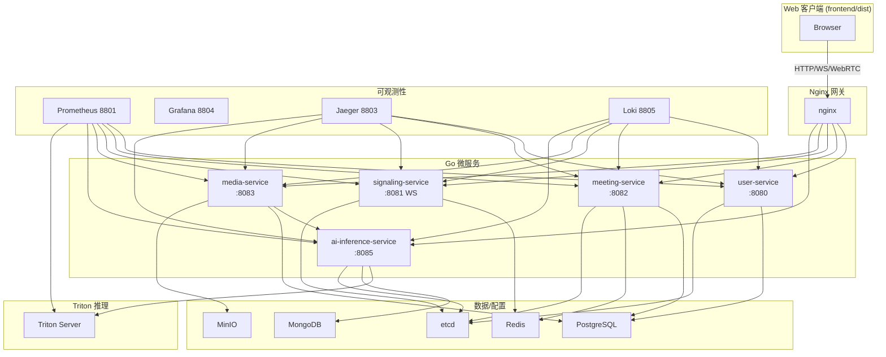

# 🏗️ 后端服务架构详解

## 📊 系统架构总览

## 🎯 服务职责

- **user-service (8080)**：注册/登录、JWT 与 CSRF、个人资料、管理员用户管理。
- **meeting-service (8082)**：会议 CRUD、参与者加入/离开、录制元数据、我的会议列表、基础统计。
- **signaling-service (8081)**：WebSocket `/ws/signaling`、房间/会话状态、消息历史、运行统计。
- **media-service (8083)**：媒体上传/下载、录制管理、WebRTC/SFU 辅助接口、缩略图生成、MinIO 对接。
- **ai-inference-service (8085)**：`/api/v1/ai/{asr,emotion,synthesis,setup,batch,health,info,analyze}`，对接 Triton 8000。
- **Triton**：GPU 推理节点，模型仓库挂载卷 `ai-models`。

## 🔌 通信与协议

- 客户端 → 网关：HTTP(S) + WebSocket，同源调用 API。
- 网关 → 微服务：HTTP；信令保持 WebSocket upstream。
- 服务间：按需 gRPC（见 `shared/grpc`）或 HTTP；媒体服务可调用 AI 服务。
- AI 服务 → Triton：HTTP/gRPC；多节点可在 `nginx/conf.d/ai_inference_service.servers*.conf` 扩展。

## 🗄️ 数据与状态

- **PostgreSQL**：用户、会议、录制等结构化数据（初始化脚本 `backend/shared/database/schema.sql`）。
- **Redis**：Session、限流、房间状态、消息队列。
- **MongoDB**：AI 推理结果/分析数据（按需启用）。
- **MinIO**：录制/媒体文件、头像等对象存储。
- **etcd**：服务注册与命名空间。

## 📊 可观测性

- 指标：各服务 `/metrics` → Prometheus 8801 → Grafana 8804。
- 追踪：Jaeger 8803，Gin 中间件 `shared/middleware/tracing`。
- 日志：Loki + Promtail 8805，在 Grafana Explore 查询。

## ⚙️ 配置

- 默认配置：`backend/config/*.yaml`、`backend/ai-inference-service/config/ai-inference-service.yaml`。
- 环境变量覆盖：`JWT_SECRET`（必填）、数据库/Redis/ETCD 主机、`ALLOWED_ORIGINS`、AI 模型目录。
- Nginx upstream 使用容器名；AI upstream 可在 `ai_inference_service.servers.local.conf` 增补。

## 🧪 验证路径

- 健康：`/health`（各服务）、`/metrics`。
- API 关键路径：
  - `POST /api/v1/auth/login` → 获取 JWT
  - `GET /api/v1/meetings`（需 JWT）
  - WS `ws://<host>:8800/ws/signaling`
  - `POST /api/v1/ai/asr`（音频 base64）
- 测试脚本：`backend/tests/run_all_tests.sh`、`test_nginx_gateway.sh`、`quick_integration_test.sh`。

## 🛡️ 安全注意

- 生产必须自定义 `JWT_SECRET`，建议启用 HTTPS（证书位于 `nginx/ssl/`）。
- CORS/CSRF：user-service 提供 CSRF Token 接口，前端同源默认可用。
- 替换默认数据库/对象存储凭据，避免使用示例密码部署生产环境。
