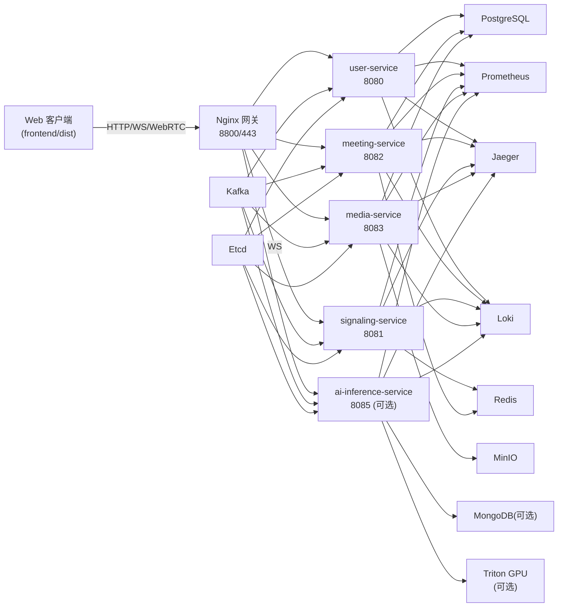

# 🏗️ 后端服务架构详解

本节聚焦微服务职责、通信方式、数据落地和可观测性，覆盖 `meeting-system` 中的所有后端组件。

## 架构总览

> `docker-compose.yml` 默认注释 `triton` 与 `ai-inference-service`，在远程/独立 GPU 场景启用（见部署文档）。

## 服务职责

- **user-service (8080)**  
  认证（注册/登录/刷新）、JWT 与 CSRF、用户资料管理、管理员用户 CRUD。
- **meeting-service (8082)**  
  会议 CRUD、参会者加入/离开、我的会议/历史、房间与录制元数据。
- **signaling-service (8081)**  
  WebSocket `/ws/signaling`，维护房间/会话状态与统计，提供会话查询接口。
- **media-service (8083)**  
  媒体上传/下载、录制控制、WebRTC/SFU 辅助接口、缩略图生成、MinIO 对接。
- **ai-inference-service (8085，可选)**  
  `/api/v1/ai/{asr,emotion,synthesis,setup,batch,info,health}`，直连或转发至 Triton。
- **Triton**  
  GPU 推理节点，模型仓库以卷挂载，名称与输入输出需与 `backend/ai-inference-service/config/ai-inference-service.yaml` 对齐。

## 通信与协议

- 客户端 → Nginx：HTTP(S) + WebSocket，同源访问 `/api/v1/*` 与 `/ws/signaling`。
- Nginx → 微服务：HTTP；信令保持 WS upstream。
- 服务间：主要使用 HTTP；Kafka 负责异步任务与事件（队列前缀 `meeting.*`）。gRPC 仅在部分内部调用场景使用（见 `backend/shared/grpc`）。
- AI → Triton：HTTP/gRPC；多节点通过 `nginx/conf.d/ai_inference_service.servers*.conf` 负载均衡。

## 数据与状态

- **PostgreSQL**：核心业务数据，初始化 SQL 在 `backend/shared/database/schema.sql`，结构说明见 `DATABASE_SCHEMA.md`。
- **Redis**：会话、房间状态、限流、短期缓存。
- **Kafka**：消息队列与事件总线，配置位于 `backend/config/*.yaml` 的 `message_queue`/`event_bus`。
- **Kafka 运行模式**：默认单节点 KRaft，主题前缀 `meeting.*`；可切换到外部集群并调整 `kafka.brokers`、SASL/TLS，或在开发环境降级为内存队列（仅单实例）。
- **MinIO**：录制与媒资文件存储，桶配置在 `backend/config/media-service.yaml`。
- **MongoDB**：AI 结果或分析数据（可选，未启用不影响主流程）。
- **etcd**：服务注册与配置命名空间。

## 可观测性与安全

- 指标：各服务暴露 `/metrics`，Prometheus 采集，Grafana 8804 可视化。
- 追踪：Jaeger 8803，Gin 链路中间件位于 `backend/shared/middleware/tracing`。
- 日志：Loki/Promtail 8805 自动收集容器日志。
- 安全基线：必须设置 `JWT_SECRET`，生产启用 HTTPS（证书位于 `nginx/ssl/`），按需收紧 `ALLOWED_ORIGINS` 与 MinIO/DB 凭据。

## 配置入口

- 微服务配置：`backend/config/*.yaml`
- AI 配置：`backend/ai-inference-service/config/ai-inference-service.yaml`
- 网关：`nginx/nginx.conf`、`nginx/conf.d/*.conf`
- 监控：`monitoring/`（Prometheus/Grafana/Loki）

环境变量可覆盖数据库、Redis、etcd、Kafka、JWT、CORS 等关键字段；AI upstream 可通过 `nginx/conf.d/ai_inference_service.servers.local.conf` 扩展。

## 验证与调试路径

- 健康检查：`/health`（所有服务）、`/metrics`
- 典型调用：
  - `POST /api/v1/auth/login` → 获取 JWT
  - `GET /api/v1/meetings`（需 JWT）
  - WS `ws://<host>:8800/ws/signaling`
  - `POST /api/v1/ai/asr`（启用 AI 后）
- 测试脚本：`backend/tests/run_all_tests.sh`、`quick_integration_test.sh`、`test_nginx_gateway.sh`

## 风险与注意

- 默认 compose 使用演示凭据，请在生产更换数据库/MinIO/Kafka/Redis 密码并限制暴露端口。
- AI 与 GPU 模型不在仓库内分发；按部署文档准备模型仓库并确认 Triton 可达。
- Kafka 必须启动，否则队列/事件功能会降级到内存或直接失败，具体行为取决于配置。
- 启动顺序建议：先基础设施（PostgreSQL/Redis/Kafka/etcd/MinIO）→ 微服务 → 网关；AI 节点可独立启动并再加载到网关上游。

## 更细的调用链与依赖

- **用户/认证**：`user-service` 读写 Postgres，利用 Redis 做会话/限流，Kafka 可承载审计/通知事件，返回 JWT/CSRF 后由 Nginx 同源分发。
- **会议/参会者**：`meeting-service` 负责会议/参与者 CRUD 与录制元数据，调用 Redis 共享房间状态，必要时发布 Kafka 事件（如录制开始/结束）。
- **信令**：`signaling-service` 维护 WS 会话与房间成员，状态落 Redis，可将统计/清理任务推到 Kafka；提供会话/房间查询 REST 接口。
- **媒体**：`media-service` 管理媒资上传/下载、录制控制与 WebRTC 辅助信息，持久化 Postgres + MinIO；可调用 AI 服务检查流状态；Kafka 用于异步处理或通知。
- **AI（可选）**: `ai-inference-service` 将 `/api/v1/ai/*` 转换为 Triton 请求，必要时缓存/限流（Redis），可选写入结果到 Mongo；上游列表通过 Nginx upstream 控制。

## 配置与环境变量（要点）

- 默认配置位于 `backend/config/*.yaml` 与 `backend/ai-inference-service/config/ai-inference-service.yaml`；数据库/Redis/Kafka/etcd/MinIO/Triton/JWT/CORS 等均可由环境变量覆盖。
- Nginx upstream 依赖容器名或本地生成的 conf（AI 上游），证书位于 `nginx/ssl/`。
- Kafka SASL/TLS、MinIO/DB 密码、`JWT_SECRET`、`ALLOWED_ORIGINS` 等敏感信息建议通过 `.env` 或 Secret 注入，避免提交到仓库。
