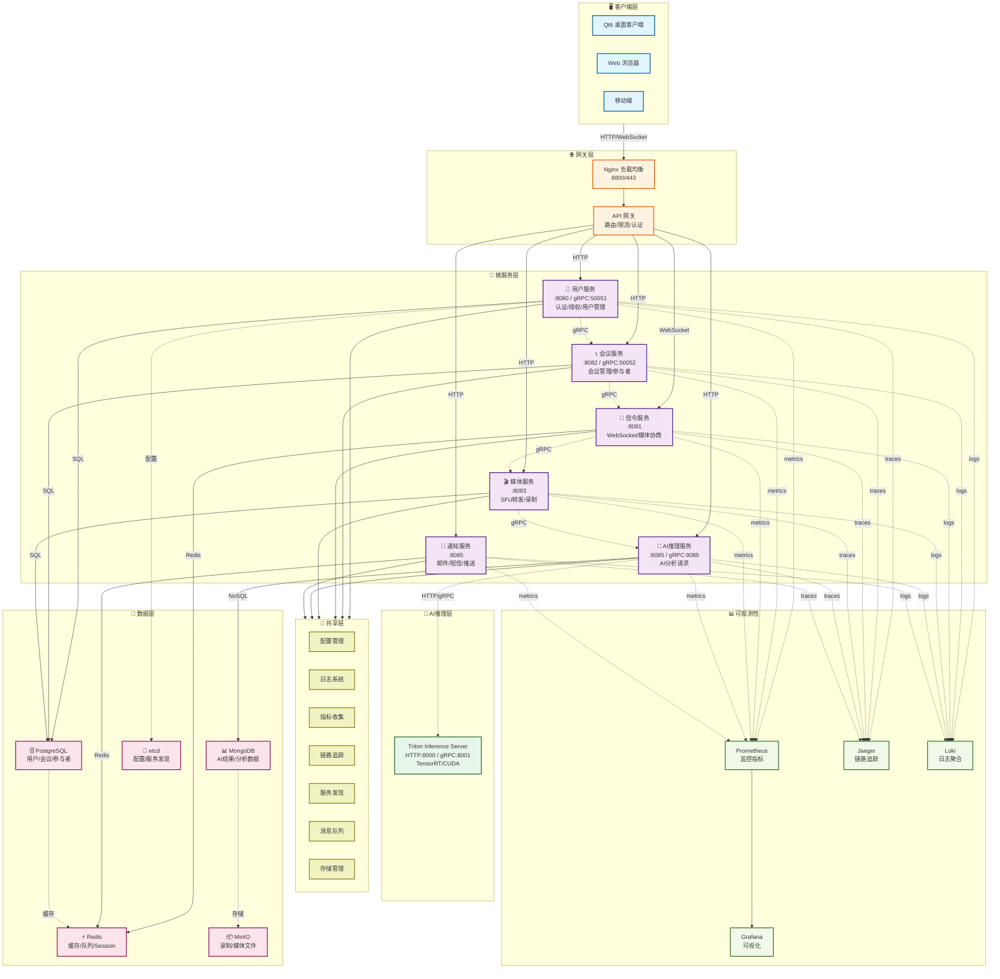
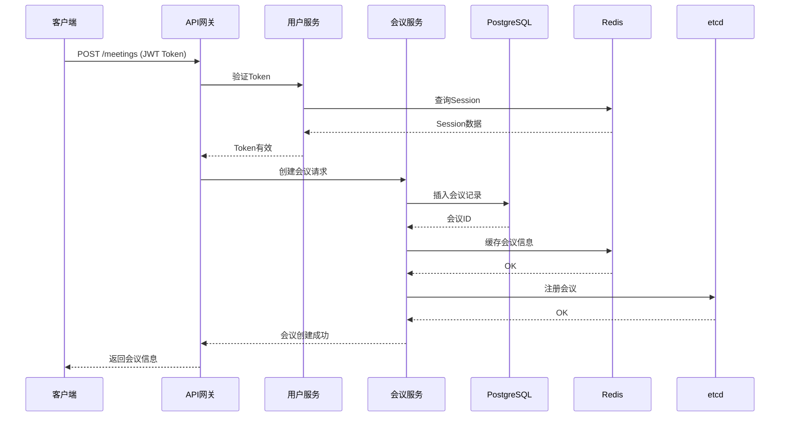
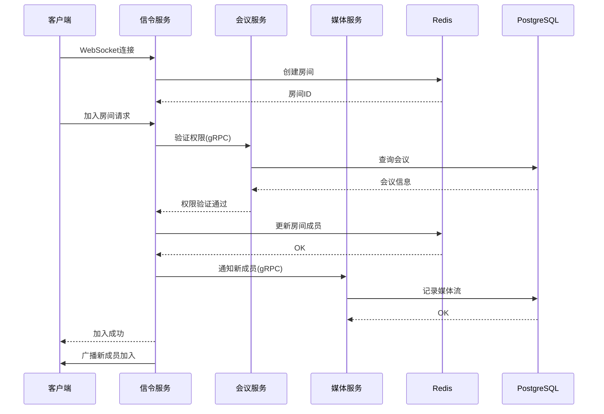
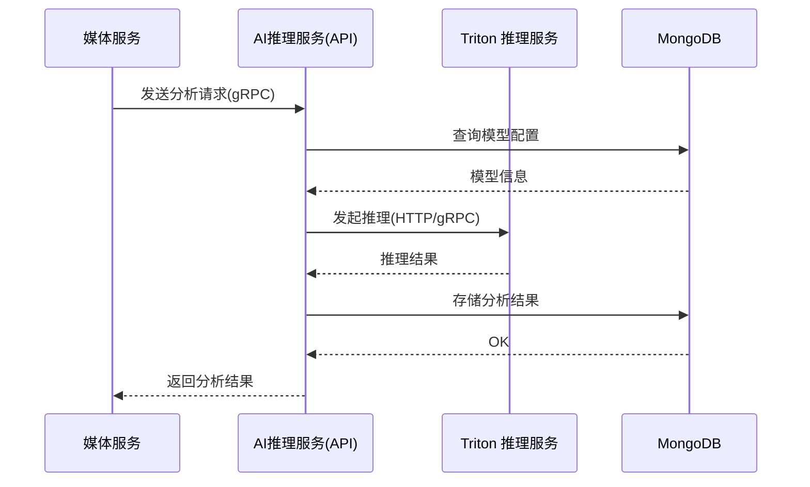

# 🏗️ 后端服务架构详解

## 📊 系统架构总览



---

## 🎯 微服务详解

### 1️⃣ 用户服务 (User Service)

**端口**: 8080 (HTTP) / 50051 (gRPC)

**职责**:
- 用户注册、登录、认证
- JWT Token 生成和验证
- 用户资料管理
- 权限控制和授权
- 用户角色管理

**依赖**:
- PostgreSQL: 用户数据存储
- Redis: Session 缓存、Token 黑名单
- etcd: 服务发现、配置管理

**通信方式**:
- HTTP REST API (客户端)
- gRPC (服务间通信)

**关键接口**:
```
POST   /api/v1/auth/register      # 用户注册
POST   /api/v1/auth/login         # 用户登录
POST   /api/v1/auth/logout        # 用户登出
GET    /api/v1/users/:id          # 获取用户信息
PUT    /api/v1/users/:id          # 更新用户信息
POST   /api/v1/auth/refresh       # 刷新Token
```

---

### 2️⃣ 会议服务 (Meeting Service)

**端口**: 8082 (HTTP) / 50052 (gRPC)

**职责**:
- 会议创建、更新、删除
- 会议参与者管理
- 会议权限控制
- 会议状态管理
- 参与者邀请

**依赖**:
- PostgreSQL: 会议数据存储
- Redis: 会议状态缓存
- etcd: 服务发现
- gRPC: 与用户服务通信

**通信方式**:
- HTTP REST API (客户端)
- gRPC (服务间通信)

**关键接口**:
```
POST   /api/v1/meetings           # 创建会议
GET    /api/v1/meetings/:id       # 获取会议信息
PUT    /api/v1/meetings/:id       # 更新会议
DELETE /api/v1/meetings/:id       # 删除会议
POST   /api/v1/meetings/:id/join  # 加入会议
POST   /api/v1/meetings/:id/leave # 离开会议
```

---

### 3️⃣ 信令服务 (Signaling Service)

**端口**: 8081 (HTTP/WebSocket)

**职责**:
- WebSocket 连接管理
- 媒体协商 (SDP/ICE)
- 房间管理
- 消息转发
- 连接状态管理

**依赖**:
- Redis: 房间状态、消息队列
- etcd: 服务发现
- gRPC: 与其他服务通信

**通信方式**:
- WebSocket (客户端实时通信)
- gRPC (服务间通信)

**WebSocket 消息类型**:
```
join_room          # 加入房间
leave_room         # 离开房间
offer              # WebRTC Offer
answer             # WebRTC Answer
ice_candidate      # ICE 候选
```

---

### 4️⃣ 媒体服务 (Media Service)

**端口**: 8083 (HTTP)

**职责**:
- SFU 媒体转发
- 会议录制
- 媒体处理 (FFmpeg)
- 媒体统计
- 录制文件管理

**依赖**:
- PostgreSQL: 录制元数据
- MinIO: 录制文件存储
- FFmpeg: 媒体处理
- gRPC: 与其他服务通信

**通信方式**:
- HTTP REST API
- gRPC (服务间通信)
- WebRTC (媒体传输)

**关键接口**:
```
POST   /api/v1/recordings         # 开始录制
POST   /api/v1/recordings/:id/stop # 停止录制
GET    /api/v1/recordings/:id     # 获取录制信息
GET    /api/v1/media/stats        # 获取媒体统计
```

---

### 5️⃣ AI 服务 (AI Service)

**端口**: 8084 (HTTP) / 9084 (gRPC)

**职责**:
- AI 分析请求处理
- 模型管理
- 推理结果存储
- 节点健康检查
- 负载均衡

**依赖**:
- MongoDB: AI 结果存储
- Redis: 缓存、队列
- PostgreSQL: 配置存储
- AI Inference Service: 推理执行（HTTP/gRPC）

**通信方式**:
- HTTP REST API
- gRPC (服务间通信)
- HTTP/gRPC (与 AI 推理服务通信)

**支持的 AI 功能**:
- 语音识别 (ASR)
- 情感检测
- 合成检测 (Deepfake)
- 音频降噪
- 视频增强

---

### 6️⃣ 通知服务 (Notification Service)

**端口**: 8085 (HTTP)

**职责**:
- 邮件发送
- 短信发送
- 推送通知
- 通知队列管理
- 通知历史记录

**依赖**:
- Redis: 消息队列
- PostgreSQL: 通知历史
- 第三方服务: 邮件、短信、推送

**通信方式**:
- HTTP REST API
- 消息队列 (Redis)

---

## 🔧 共享层 (Shared Layer)

所有微服务共享的通用功能:

| 模块 | 功能 |
|------|------|
| **config** | 配置管理、环境变量处理 |
| **logger** | 日志记录、日志级别控制 |
| **database** | 数据库连接、连接池管理 |
| **grpc** | gRPC 客户端、服务器、拦截器 |
| **metrics** | Prometheus 指标收集 |
| **tracing** | Jaeger 链路追踪 |
| **middleware** | HTTP 中间件、CORS、认证 |
| **models** | 数据模型定义 |
| **queue** | 消息队列、Redis 操作 |
| **storage** | 文件存储、MinIO 操作 |
| **discovery** | 服务发现、etcd 操作 |

---

## 📊 数据流示例

### 用户加入会议流程

```
1. 客户端 → 用户服务: 登录请求
2. 用户服务 → PostgreSQL: 验证用户
3. 用户服务 → Redis: 存储 Session
4. 用户服务 → 客户端: 返回 JWT Token

5. 客户端 → 会议服务: 加入会议请求
6. 会议服务 → PostgreSQL: 查询会议信息
7. 会议服务 → Redis: 更新会议状态
8. 会议服务 → 信令服务: 通知新用户加入

9. 客户端 → 信令服务: WebSocket 连接
10. 信令服务 → Redis: 存储房间状态
11. 信令服务 → 客户端: 返回房间信息

12. 客户端 → 媒体服务: WebRTC 连接
13. 媒体服务 → PostgreSQL: 记录媒体流
14. 媒体服务 → 其他客户端: 转发媒体流
```

---

## 🔄 服务间通信

### gRPC 通信

用于服务间的同步通信:
- 用户服务 ↔ 会议服务
- 会议服务 ↔ 信令服务
- 媒体服务 ↔ AI 服务

### HTTP/gRPC 通信

用于 AI 服务与 AI 推理服务的同步通信:
- 请求/应答模式
- gRPC 流式音频

### Redis 消息队列

用于异步任务处理:
- 通知队列
- 媒体处理队列
- 日志队列

---

## 📈 可观测性

### Prometheus 指标

每个服务收集:
- HTTP 请求数、延迟、错误率
- gRPC 请求数、延迟、错误率
- 数据库连接数、查询时间
- 缓存命中率

### Jaeger 链路追踪

追踪完整的请求链路:
- 跨服务调用
- 数据库查询
- 缓存操作

### Loki 日志聚合

收集所有服务的日志:
- 应用日志
- 错误日志
- 审计日志

---

## � 服务交互流程图

### 会议创建流程



### 用户加入会议流程



### AI分析请求流程



---

## �🚀 部署架构

```
Docker Compose 编排:
├── user-service (容器)
├── meeting-service (容器)
├── signaling-service (容器)
├── media-service (容器)
├── ai-inference-service (容器)
├── notification-service (容器)
├── PostgreSQL (容器)
├── Redis (容器)
├── MongoDB (容器)
├── MinIO (容器)
├── etcd (容器)
├── Nginx (容器)
├── Prometheus (容器)
├── Grafana (容器)
├── Jaeger (容器)
└── Loki (容器)
```

所有服务通过 Docker 网络互联，支持水平扩展。
