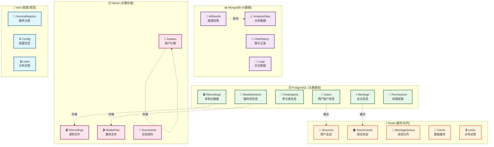

# 💾 数据库架构设计

## 📊 数据库总览



---

## 🗄️ PostgreSQL 数据库设计

### 用户表 (users)

```sql
CREATE TABLE users (
    id BIGSERIAL PRIMARY KEY,
    username VARCHAR(255) UNIQUE NOT NULL,
    email VARCHAR(255) UNIQUE NOT NULL,
    password_hash VARCHAR(255) NOT NULL,
    full_name VARCHAR(255),
    avatar_url VARCHAR(512),
    status VARCHAR(50) DEFAULT 'active',
    role VARCHAR(50) DEFAULT 'user',
    created_at TIMESTAMP DEFAULT CURRENT_TIMESTAMP,
    updated_at TIMESTAMP DEFAULT CURRENT_TIMESTAMP,
    deleted_at TIMESTAMP
);

CREATE INDEX idx_users_email ON users(email);
CREATE INDEX idx_users_username ON users(username);
```

### 会议表 (meetings)

```sql
CREATE TABLE meetings (
    id BIGSERIAL PRIMARY KEY,
    title VARCHAR(255) NOT NULL,
    description TEXT,
    creator_id BIGINT NOT NULL REFERENCES users(id),
    status VARCHAR(50) DEFAULT 'scheduled',
    start_time TIMESTAMP NOT NULL,
    end_time TIMESTAMP,
    max_participants INT DEFAULT 100,
    is_recording BOOLEAN DEFAULT FALSE,
    created_at TIMESTAMP DEFAULT CURRENT_TIMESTAMP,
    updated_at TIMESTAMP DEFAULT CURRENT_TIMESTAMP,
    deleted_at TIMESTAMP
);

CREATE INDEX idx_meetings_creator_id ON meetings(creator_id);
CREATE INDEX idx_meetings_status ON meetings(status);
CREATE INDEX idx_meetings_start_time ON meetings(start_time);
```

### 参与者表 (meeting_participants)

```sql
CREATE TABLE meeting_participants (
    id BIGSERIAL PRIMARY KEY,
    meeting_id BIGINT NOT NULL REFERENCES meetings(id),
    user_id BIGINT NOT NULL REFERENCES users(id),
    join_time TIMESTAMP DEFAULT CURRENT_TIMESTAMP,
    leave_time TIMESTAMP,
    role VARCHAR(50) DEFAULT 'participant',
    is_muted BOOLEAN DEFAULT FALSE,
    is_video_on BOOLEAN DEFAULT TRUE,
    created_at TIMESTAMP DEFAULT CURRENT_TIMESTAMP
);

CREATE INDEX idx_participants_meeting_id ON meeting_participants(meeting_id);
CREATE INDEX idx_participants_user_id ON meeting_participants(user_id);
CREATE UNIQUE INDEX idx_participants_unique ON meeting_participants(meeting_id, user_id);
```

### 录制表 (meeting_recordings)

```sql
CREATE TABLE meeting_recordings (
    id BIGSERIAL PRIMARY KEY,
    meeting_id BIGINT NOT NULL REFERENCES meetings(id),
    file_path VARCHAR(512) NOT NULL,
    file_size BIGINT,
    duration INT,
    format VARCHAR(50),
    status VARCHAR(50) DEFAULT 'processing',
    created_at TIMESTAMP DEFAULT CURRENT_TIMESTAMP,
    updated_at TIMESTAMP DEFAULT CURRENT_TIMESTAMP
);

CREATE INDEX idx_recordings_meeting_id ON meeting_recordings(meeting_id);
CREATE INDEX idx_recordings_status ON meeting_recordings(status);
```

### 媒体流表 (media_streams)

```sql
CREATE TABLE media_streams (
    id BIGSERIAL PRIMARY KEY,
    meeting_id BIGINT NOT NULL REFERENCES meetings(id),
    participant_id BIGINT NOT NULL REFERENCES meeting_participants(id),
    stream_type VARCHAR(50),
    codec VARCHAR(50),
    bitrate INT,
    resolution VARCHAR(50),
    created_at TIMESTAMP DEFAULT CURRENT_TIMESTAMP,
    updated_at TIMESTAMP DEFAULT CURRENT_TIMESTAMP
);

CREATE INDEX idx_streams_meeting_id ON media_streams(meeting_id);
CREATE INDEX idx_streams_participant_id ON media_streams(participant_id);
```

---

## ⚡ Redis 数据结构

### Session 存储

```
Key: session:{session_id}
Value: {
    user_id: 123,
    username: "john_doe",
    email: "john@example.com",
    login_time: 1234567890,
    last_activity: 1234567890
}
TTL: 3600 (1小时)
```

### 房间状态

```
Key: room:{room_id}
Value: {
    meeting_id: 456,
    participants: [user_id1, user_id2, ...],
    created_at: 1234567890,
    status: "active"
}
TTL: 86400 (24小时)
```

### 消息队列

```
Key: queue:notifications
Type: List
Values: [
    {type: "email", to: "user@example.com", subject: "..."},
    {type: "sms", to: "+1234567890", message: "..."},
    ...
]
```

### 分布式锁

```
Key: lock:{resource_id}
Value: {lock_holder_id}
TTL: 30 (30秒)
```

---

## 📊 MongoDB 集合设计

### AI 分析结果 (ai_results)

```json
{
    "_id": ObjectId,
    "meeting_id": 456,
    "participant_id": 789,
    "analysis_type": "emotion_detection",
    "result": {
        "emotion": "happy",
        "confidence": 0.95,
        "timestamp": 1234567890
    },
    "created_at": ISODate("2024-01-01T00:00:00Z")
}
```

### 聊天记录 (chat_history)

```json
{
    "_id": ObjectId,
    "meeting_id": 456,
    "sender_id": 123,
    "message": "Hello everyone!",
    "timestamp": 1234567890,
    "created_at": ISODate("2024-01-01T00:00:00Z")
}
```

### 日志数据 (logs)

```json
{
    "_id": ObjectId,
    "service": "media-service",
    "level": "info",
    "message": "Recording started",
    "timestamp": 1234567890,
    "created_at": ISODate("2024-01-01T00:00:00Z")
}
```

---

## 📦 MinIO 对象存储结构

```
meeting-system/
├── recordings/
│   ├── meeting_456/
│   │   ├── recording_20240101_120000.mp4
│   │   └── recording_20240101_120000.log
│   └── meeting_789/
├── media/
│   ├── avatars/
│   │   ├── user_123.jpg
│   │   └── user_456.jpg
│   └── documents/
│       ├── meeting_456_notes.pdf
│       └── meeting_456_slides.pptx
└── temp/
    └── uploads/
```

---

## 🔧 etcd 配置存储

```
/meeting-system/config/
├── /services/user-service/
│   ├── /host: "0.0.0.0"
│   ├── /port: "8080"
│   └── /grpc_port: "50051"
├── /services/meeting-service/
│   ├── /host: "0.0.0.0"
│   ├── /port: "8082"
│   └── /grpc_port: "50052"
└── /services/media-service/
    ├── /host: "0.0.0.0"
    ├── /port: "8083"
    └── /grpc_port: "50053"

/meeting-system/services/
├── /user-service/
│   ├── /instance_1: {host, port, metadata}
│   └── /instance_2: {host, port, metadata}
├── /meeting-service/
│   ├── /instance_1: {host, port, metadata}
│   └── /instance_2: {host, port, metadata}
└── /media-service/
    ├── /instance_1: {host, port, metadata}
    └── /instance_2: {host, port, metadata}
```

---

## 📈 数据库性能优化

### 索引策略

| 表 | 索引 | 用途 |
|------|------|------|
| users | email, username | 快速查询用户 |
| meetings | creator_id, status, start_time | 查询会议列表 |
| participants | meeting_id, user_id | 查询参与者 |
| recordings | meeting_id, status | 查询录制 |
| media_streams | meeting_id, participant_id | 查询媒体流 |

### 连接池配置

```yaml
database:
  max_idle_conns: 10
  max_open_conns: 100
  conn_max_lifetime: 3600
```

### 缓存策略

- **热数据**: 用户信息、会议信息 (TTL: 1小时)
- **温数据**: 参与者列表、媒体流 (TTL: 30分钟)
- **冷数据**: 历史录制、分析结果 (TTL: 7天)

---

## 🔄 数据一致性

### 事务处理

- 用户注册: 创建用户 + 初始化权限
- 会议创建: 创建会议 + 添加创建者为参与者
- 参与者加入: 更新参与者列表 + 更新房间状态

### 缓存同步

- 写入 PostgreSQL 后更新 Redis 缓存
- 缓存失效时重新从数据库加载
- 使用 TTL 自动过期缓存

---

## 📊 数据备份策略

- **PostgreSQL**: 每天全量备份 + 每小时增量备份
- **MongoDB**: 每天全量备份
- **MinIO**: 跨区域复制
- **etcd**: 每小时快照备份

